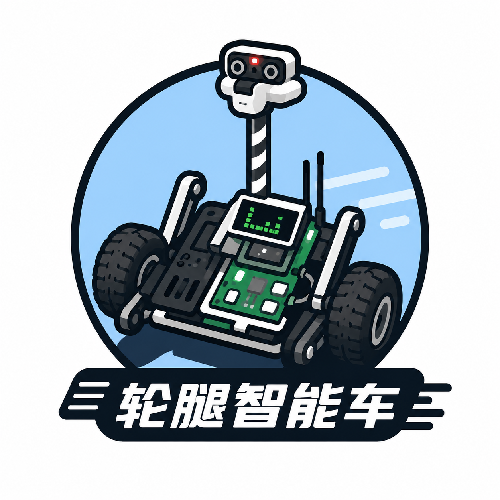

<div align="center">
  <h1 style="font-family: 'Arial', sans-serif; color: #333;">🚗 Wheel-legged-autocar</h1>
  <h2 style="font-size: 2.2rem; color: #777;">第 21 届全国大学生智能汽车竞赛 · 轮腿穿越组 —— 省赛国赛代码，开发全流程开源</h2>
  
</div>

<!-- 徽章区 -->
<div align="center">
  <a href="https://github.com/boatchanting/Wheel-legged-autocar"></a>
  
  
  
  
</div>

<div align="center">
  <p>本项目基于 CYT4BB 双核 Cortex‑M7 平台，融合轮腿运动控制与视觉巡线算法，提供从底层驱动到上层决策的完整工程实现。仓库公开的是一套真实参赛项目：双轮足（轮腿）智能车的软件、硬件适配、视觉算法、导航控制、调试工具和过程文档。代码以“能复现、可分析、便于二次开发”为目标整理，欢迎用于学习、研究和改进。代码结构清晰、注释详尽，适合智能车竞赛及机器人爱好者学习与二次开发。</p>
</div>

## 目录

- [Wheel-legged-autocar：轮腿智能车完整开源工程](#wheel-legged-autocar轮腿智能车完整开源工程)
  - [目录](#目录)
  - [项目简介](#项目简介)
  - [功能总览](#功能总览)
    - [运动控制](#运动控制)
    - [导航与比赛科目](#导航与比赛科目)
    - [视觉与通信](#视觉与通信)
    - [工具链](#工具链)
  - [系统架构](#系统架构)
  - [仓库结构](#仓库结构)
    - [项目文件树详解](#项目文件树详解)
  - [硬件与软件环境](#硬件与软件环境)
    - [车端](#车端)
    - [PC 端](#pc-端)
  - [快速开始](#快速开始)
    - [1. 获取代码](#1-获取代码)
    - [2. 打开 IAR 双核工程](#2-打开-iar-双核工程)
    - [3. 首次上电检查](#3-首次上电检查)
  - [配置说明](#配置说明)
  - [PC 工具](#pc-工具)
  - [文档导航](#文档导航)
  - [安全与复现边界](#安全与复现边界)
  - [贡献与交流](#贡献与交流)
  - [致谢](#致谢)

## 项目简介

Wheel-legged-autocar 是面向智能汽车竞赛轮腿穿越组的双轮足机器人软件工程。平台采用逐飞 CYT4BB 开源库和 Cortex‑M7 双核 MCU：

- **CM7_0（0 核）**：实时控制主核，负责 IMU/EKF、平衡与多环 PID、轮毂电机、舵机、遥控器、GNSS/惯导、轨迹记录回放和科目状态机。
- **CM7_1（1 核）**：视觉与图传协处理核，负责 MT9V03X 摄像头采集、图像压缩、PVC/单边桥/颠簸路视觉识别、IPM 坐标变换及跨核结果发布。

项目覆盖备赛、标定、离线验证、实车调试和比赛版本维护，代码中保留了不同车辆、传感器和科目的配置入口，便于对照实验。

## 功能总览

### 运动控制

- IMU660RA/IMU660RB/IMU963RA 适配与姿态 EKF
- 速度、角度、角速度、转向、横滚平衡等多环 PID
- 双轮差速/转向控制、无刷电机串口输出、舵机位置和动作执行器
- 起立瞄准发车、跳跃动作、落地缓冲和侧向打滑检测

### 导航与比赛科目

- GNSS 经纬度到局部平面坐标转换
- 惯性导航、轨迹 RAM 记录、Flash 保存、静态轨迹回放
- 科目一至科目四的路径跟踪、速度规划和任务状态机
- 地雷区、单边桥、颠簸路、三级台阶/跳跃等专用控制逻辑

### 视觉与通信

- PVC 白色目标、桥线/直线、颠簸路特征识别
- 逆透视（IPM）和像素到物理坐标估计
- CM7_0 ↔ CM7_1 视觉 IPC：任务门控、复位请求、结果发布与轮询
- WiFi 图传、遥测、自定义协议及逐飞助手兼容接口

### 工具链

- GNSS/惯导轨迹可视化、坐标对齐、回环与路径规划分析
- PID 调参、轮腿运动学、Pure Pursuit/MPC/RL 仿真
- IMU/磁力计/逆透视标定和车载视频 CV 离线测试
- WebView 导航点标注、CSV 转 C 路线表、WiFi/视频上位机

## 系统架构

```text
                         ┌──────────────────────────┐
                         │        CYT4BB MCU         │
                         │     Cortex-M7 双核心      │
                         └────────────┬─────────────┘
                                      │ 共享 RAM / IPC
                 ┌────────────────────┴────────────────────┐
                 │                                         │
      ┌──────────▼──────────┐                  ┌──────────▼──────────┐
      │ CM7_0：实时控制      │                  │ CM7_1：视觉协处理      │
      │ user/main_cm7_0.c    │                  │ user/main_cm7_1.c    │
      │ 1 ms PIT + ISR       │                  │ 摄像头帧循环 + PIT    │
      └──────────┬──────────┘                  └──────────┬──────────┘
                 │                                         │
      ┌──────────▼──────────┐                  ┌──────────▼──────────┐
      │ EKF / PID / 导航     │                  │ PVC / Bridge / Bumpy │
      │ 电机 / 舵机 / 任务    │                  │ IPM / 图传 / 遥测      │
      └─────────────────────┘                  └─────────────────────┘
```

典型数据链路：摄像头完成一帧采集后由 1 核运行选中的视觉算法，结果写入 IPC；0 核在周期中断中读取结果并转换为转向、速度或科目控制量，最终输出到电机和舵机。

## 仓库结构

```text
.
├── user/                         # 双核入口、PIT/UART 中断与初始化
├── code/                         # 0 核：控制、导航、任务、执行器、视觉控制
│   ├── config/                   # 车辆、科目、IMU、WiFi 等编译期配置
│   ├── calculate/                # EKF、矩阵、PID
│   ├── navigation/               # GNSS/惯导、轨迹记录与回放
│   ├── plan/                     # 雷区、单边桥、颠簸路等任务逻辑
│   ├── servo/                    # 舵机映射、动作执行器、跳跃动作
│   ├── vision/                   # 0 核视觉 IPC 与视觉控制适配
│   └── tools/                    # 蜂鸣器、屏幕、SBUS、WiFi、遥测
├── code1/                        # 1 核：视觉算法、图像处理、图传
│   └── vision/                   # PVC、桥线、颠簸路、IPM、IPC
├── libraries/                    # 逐飞 CYT4BB 库、SDK、CMSIS、设备驱动
│   └── doc/                      # 第三方库版权与许可证说明
├── CYT2BL3FOC/                   # 独立的 CYT2BL3 双驱无刷电机工程
├── iar/                          # IAR 双核工程与链接脚本
├── tools/                        # PC 端分析、仿真、标定、上位机工具
├── docs/                         # 架构、调参、任务规划和问题复盘
```

更细的逐文件说明见 [`docs/project-structure/README.md`](docs/project-structure/README.md)。

### 项目文件树详解

| 路径 | 内容与职责 | 从哪里开始看 |
| --- | --- | --- |
| `user/` | 双核启动入口、外设初始化、PIT/UART 中断服务。决定“什么时候调用哪个模块”。 | `main_cm7_0.c`、`cm7_0_isr.c`、`main_cm7_1.c` |
| `code/config/` | 车辆编号、IMU、WiFi、显示、遥控、科目和发车策略等编译期宏。 | `config.h`、`car_select.h`、`sys_options.h` |
| `code/calculate/` | 姿态估计和底层控制算法。 | `ekf.c`、`matrix.c`、`pid-new.c` |
| `code/navigation/` | GNSS/惯导坐标处理、轨迹记录、Flash 存取、回放和路径跟踪计划。 | `inertial_nav.c`、`gnss_transform.c`、`nav_replay/` |
| `code/plan/` | 比赛科目状态机和动作编排。 | `bridge.c`、`minefield.c`、`bumpy_road.c` |
| `code/servo/` | 舵机角度映射、平滑执行、跳跃及落地动作。 | `servo.c`、`servo_executor.c`、`servo_jump.c` |
| `code/vision/` | 0 核侧视觉任务门控、IPC 轮询，以及将识别结果接入转向/速度控制。 | `vision_ipc_core0.c`、`vision_*_control.c` |
| `code/tools/` | 蜂鸣器、屏幕菜单、SBUS、WiFi、遥测和运行耗时统计。 | `menu.c`、`sbus.c`、`telemetry_ipc_core0.c` |
| `code1/vision/` | 1 核图像算法和跨核结果发布。 | `pvc_vision.c`、`bumpy_vision.c`、`ipm_transform.c` |
| `code1/tools/` | 摄像头调试菜单等 1 核辅助模块。 | `camera_menu.c` |
| `libraries/zf_*` | 逐飞公共组件、设备驱动、传感器驱动和板级适配。 | 结合 `zf_common_headfile.h` 查找引用 |
| `libraries/sdk/` | CYT4BB 芯片 SDK、CMSIS/ARM Math 和启动/底层头文件。 | IAR include path |
| `libraries/doc/` | 第三方库版本、版权和 GPL 声明。 | `version.txt`、`GPL3_permission_statement.txt` |
| `iar/` | IAR 双核工程、链接脚本和工作区配置。 | `project_config/cyt4bb7_cm_7_0.ewp`、`cyt4bb7_cm_7_1.ewp` |
| `CYT2BL3FOC/` | 独立的 CYT2BL3 双驱无刷电机控制工程，与 CYT4BB 主工程分开编译。 | 该目录自己的 `project/` |
| `tools/` | PC 端离线分析、算法仿真、传感器标定、CV 测试和上位机。 | 先看 `tools/README.md` |
| `docs/` | 架构说明、调参记录、任务规划、问题复盘和模块文档。 | `docs/project-structure/README.md` |
| `data/`、`results/` | 本地采集数据和分析产物；通常不作为固件编译输入。 | 按工具 README 查找对应数据格式 |

源码依赖关系可以概括为：`user/` 负责调度，`code/` 提供 0 核业务，`code1/` 提供 1 核视觉，`libraries/` 提供芯片与外设能力，`tools/` 和 `docs/` 支撑验证与维护。

## 硬件与软件环境

### 车端

| 类别 | 当前工程支持 |
| --- | --- |
| MCU | Infineon/Cypress CYT4BB，Cortex‑M7 CM7_0 + CM7_1 |
| IDE/编译器 | IAR Embedded Workbench（工程按 IAR 9.40.1 整理） |
| 传感器 | IMU660RA、IMU660RB、IMU963RA、GNSS、MT9V03X 摄像头 |
| 执行器 | 双轮电机、轮腿舵机、蜂鸣器、IPS200 屏幕 |
| 通信 | SBUS 遥控器、UART、WiFi、跨核 IPC、Flash |

仓库已包含 `libraries/` 中的逐飞库、SDK 和 CMSIS 文件；具体芯片、主板引脚和外设版本仍需与你的实物一致。

### PC 端

- Python 3.9 或更高版本
- 按工具安装 `numpy`、`pandas`、`matplotlib`、`opencv-python`、`streamlit` 等依赖
- 支持现代 JavaScript 的浏览器，用于打开 HTML/WebView 工具
- 运行 `tools/07_针对小车车载视频的cv算法/` 下 C 检测器时，需要 GCC/MinGW 或 Visual Studio

目前没有统一的 `requirements.txt`，不同脚本的依赖以所在目录 README、脚本导入和报错信息为准。

## 快速开始

### 1. 获取代码

```bash
git clone https://github.com/boatchanting/Wheel-legged-autocar.git
cd Wheel-legged-autocar
```

### 2. 打开 IAR 双核工程

1. 安装 IAR Embedded Workbench，打开 `iar/project_config/cyt4bb7_cm_7_0.ewp` 和 `iar/project_config/cyt4bb7_cm_7_1.ewp`。
2. 检查两个工程的 include path，至少包含 `code/`、`code1/`、`user/` 以及 `libraries/` 下对应的 SDK、驱动和 CMSIS 目录。
3. 在 `code/config/car_select.h` 和 `code/config/sys_options.h` 中选择车辆、IMU、科目及调试开关。
4. 分别 Clean/Rebuild 两个工程，确认 0 核和 1 核均能生成固件。
5. 使用 DAP/IAR 下载器时，先烧录 CM7_0，再烧录 CM7_1；上电后先观察屏幕、串口和蜂鸣器状态。

> 工程文件只描述本项目源码和链接布局，调试器、下载器、板卡引脚及外设接线仍需按你的硬件配置。

### 3. 首次上电检查

请先将 `G_MOTOR_ENABLE_INIT`、遥控急停和机械支撑置于安全状态，完成以下检查后再让轮子离地运行：

- 舵机中位、极性、机械限位和跳跃动作幅度
- 电机左右方向、PWM 极性、轮径和轮距
- IMU 安装方向、零偏、磁力计校准和 `IMU_CATEGORY`
- GNSS 串口、摄像头曝光/分辨率、SBUS 急停
- PID 限幅、发车策略和当前科目状态机

## 配置说明

主要配置文件：

| 文件 | 作用 | 当前示例 |
| --- | --- | --- |
| [`code/config/car_select.h`](code/config/car_select.h) | 车辆和硬件差异选择 | `CAR_SELECT 4` |
| [`code/config/sys_options.h`](code/config/sys_options.h) | 全局开关、IMU、科目、遥控和调试 | `IMU_CATEGORY 3`、`CURRENT_NAV_PLAN 4` |
| [`code/config/wifi_options.h`](code/config/wifi_options.h) | WiFi 核心及协议选择 | 默认关闭 WiFi |
| [`code/calculate/pid-new.h`](code/calculate/pid-new.h) | 车辆相关 PID 预设 | 随 `CAR_SELECT` 选择 |
| [`iar/icf/linker_directives_tviibh.icf`](iar/icf/linker_directives_tviibh.icf) | Flash/RAM、向量表和段布局 | CYT4BB 链接布局 |

常见配置示例：

```c
/* code/config/car_select.h */
#define CAR_SELECT 4

/* code/config/sys_options.h */
#define IMU_CATEGORY       3   /* 1: IMU660RA, 2: IMU660RB, 3: IMU963RA */
#define CURRENT_NAV_PLAN   4   /* 1~4 对应竞赛科目 */
#define REMOTE_CONTROL     1
#define DEBUG_DISPLAY      1
#define DEBUG_LOG_ENABLE   0   /* 比赛运行建议关闭高频日志 */
#define WIFI_USE           0
```

修改配置后必须同时重编译两个核心，并重新确认 IPC 结构体、图像尺寸和共享内存布局没有被破坏。不要直接照搬其他车辆的舵机零点、PID 或传感器轴向。

## PC 工具

工具按用途分布在 `tools/`：

| 目录 | 用途 | 入口示例 |
| --- | --- | --- |
| `01_导航与定位可视化/` | GNSS/惯导轨迹、XY 对比 | `inertial_nav结果可视化.py` |
| `02_导航算法分析/` | 滤波、坐标对齐、路径规划 | `streamlit自动对齐坐标系.py` |
| `03_控制与仿真/` | PID、轮腿、Pure Pursuit/MPC/RL | `pid调参.py` |
| `04_传感器标定与测试/` | 磁力计、逆透视、压缩和 IMU 测试 | 目录内 HTML/Python |
| `05_通用数据处理工具/` | 代码统计、版本 changelog、视频上位机 | `changelog_between_tags.py` |
| `cvtest/` | 桥、地雷区、台阶离线 CV 测试 | 各场景 README |
| `webview_nav_marker/` | 惯导点标注、CSV 转 C 路线表 | `nav_marker_host.py` |
| `wifi_protocol/` | WiFi 协议和 Streamlit 上位机 | `streamlit_wifi.py` |

示例：

```bash
python tools/webview_nav_marker/nav_marker_host.py
streamlit run tools/wifi_protocol/streamlit_wifi.py
python tools/05_通用数据处理工具/changelog_between_tags.py v1.0.0 v1.1.0 --markdown
```

Windows 路径包含中文时，建议在 PowerShell 中运行并使用 Tab 补全；每个工具的输入 CSV、串口和网络端口请以对应 README 为准。

## 文档导航

- [项目结构总览](docs/project-structure/README.md)：从入口文件、双核分工到构建配置
- [代码文件概览](docs/code文件概览.md)：`user/`、`code/` 的阅读顺序和调用关系
- [双轮足结构与控制架构](docs/双轮足并联腿机器人结构与控制架构说明.md)：机构、状态和控制链路
- [PID 预设与调参记录](docs/PID_preset_work_log_260712.md)：不同工况的参数切换和调试记录
- [打滑检测说明](docs/双轮足打滑检测机制说明.md)：侧向加速度检测逻辑
- [任务规划](docs/任务规划/)：各科目方案、视觉融合和优化记录
- [CV 工具说明](tools/README.md)：离线识别、标定和上位机工具索引
- [惯导 WebView 标注](tools/webview_nav_marker/README.md)：在线打点及路线表生成

建议新成员按“项目结构 → `user/main_cm7_0.c` → `cm7_0_isr.c` → `code/calculate`、`navigation`、`plan` → `code1/vision`”顺序阅读。

## 安全与复现边界

这是竞赛实车代码，不是通用量产控制器。硬件版本、装配误差、赛道材质、传感器安装和参数标定都会显著影响结果。首次运行务必：

1. 断开或抬起驱动轮，验证急停、舵机限位和电机方向。
2. 关闭自动导航和跳跃，仅验证 IMU、遥控和基础平衡。
3. 限制最大 PWM/速度，逐项恢复视觉、导航和科目状态机。
4. 保留串口日志和参数版本，记录每次实车修改。

仓库中的数据、图片和构建输出可能较大或被 `.gitignore` 排除；缺少比赛现场硬件时，优先使用 `tools/` 离线工具复现算法流程。

## 贡献与交流

欢迎提交 Issue、Pull Request 和文档修订：

- 报告问题时请附：硬件版本、`CAR_SELECT`/`IMU_CATEGORY`、编译器版本、复现步骤、串口日志或最小数据样例。
- 新增模块请放入对应目录，补充 README 或 `docs/` 说明，并注明是否会改变共享内存、IPC 或中断时序。
- 调参、接线和安全相关修改请同时记录适用车辆与验证条件。
- 提交前请清理 IAR 临时文件、Python 缓存、个人路径和含敏感信息的配置。

## 致谢

感谢所有参与开发的ai，逐飞科技开源库、芯片原厂 SDK，以及所有参与机械设计、硬件调试、算法开发、赛场测试和文档整理的队员。

---

如果这个项目对你有帮助，欢迎点一个 Star，并把改进后的实验结果或问题反馈回来。开源的价值不只在于放出最终代码，也在于让后来者能看懂取舍、复现实验并继续前进。
