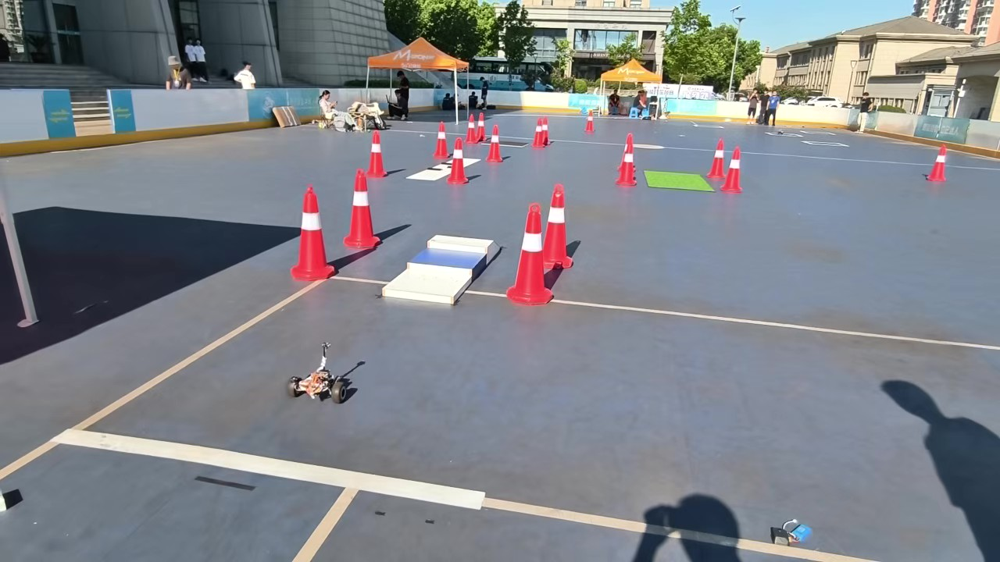
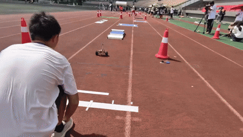
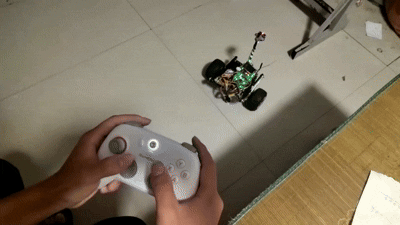
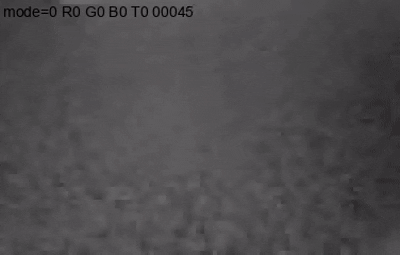
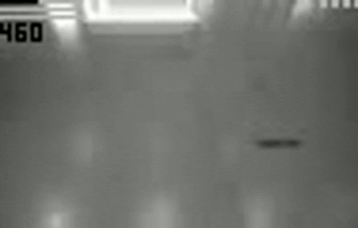
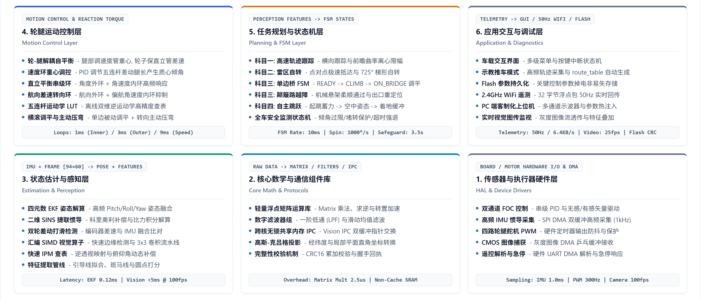
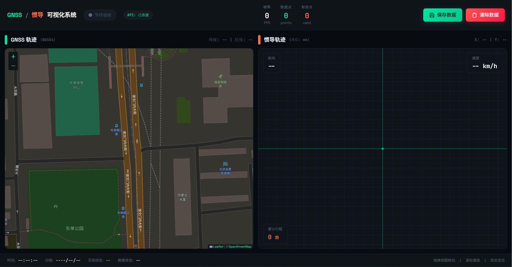
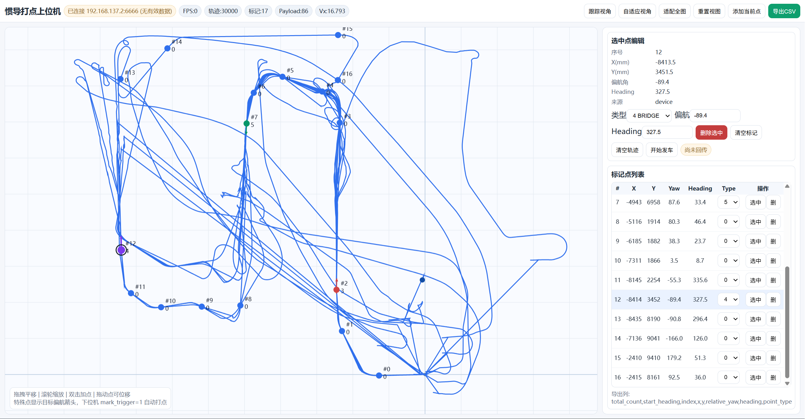
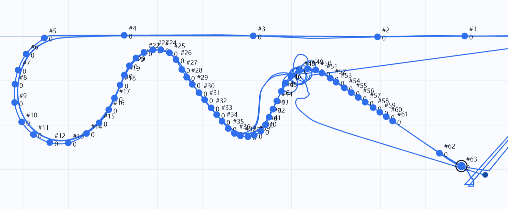
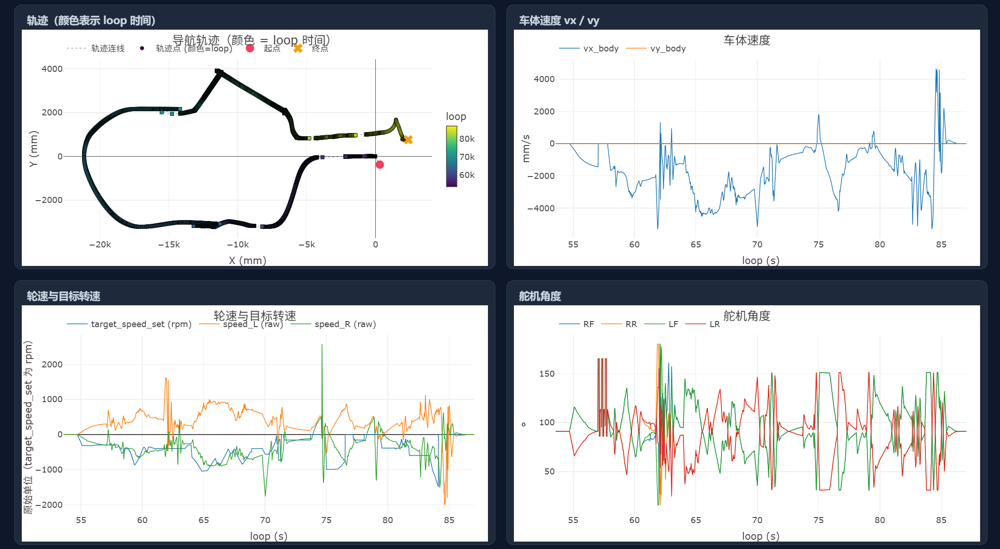

<div align="center">
  <h1 style="font-family: 'Arial', sans-serif; color: #333;">🚗 Wheel-legged-autocar</h1>
  <h2 style="font-size: 2.2rem; color: #777;">第 21 届全国大学生智能汽车竞赛 · 轮腿穿越组 —— 省赛国赛代码，开发全流程开源</h2>
  
</div>
<!-- 徽章区 -->
<div align="center">
  <a href="https://github.com/boatchanting/Wheel-legged-autocar"></a>
  <a href="https://github.com/boatchanting/Wheel-legged-autocar"></a>
  <a href="https://github.com/boatchanting/Wheel-legged-autocar/tags"></a>
  
  
  
  
  
  
  
  
  
</div>


<div align="center">
  <p>本项目基于 CYT4BB 双核 Cortex‑M7 平台，融合轮腿运动控制与视觉巡线算法，提供从底层驱动到上层决策的完整工程实现。仓库公开的是一套真实参赛项目：双轮足（轮腿）智能车的软件、硬件适配、视觉算法、导航控制、调试工具和过程文档。代码以“能复现、可分析、便于二次开发”为目标整理，欢迎用于学习、研究和改进。代码结构清晰、注释详尽，适合智能车竞赛及机器人爱好者学习与二次开发。</p>
</div>

**快速入口：** [🚀 快速开始](#-快速开始) · [自定义导航与日志上位机](#自定义导航与日志上位机) · [工程结构文档](docs/project-structure/README.md) · [PC 工具索引](tools/README.md)

<details>
<summary>目录</summary>

- [🎬 实车演示](#-实车演示)
- [项目简介](#项目简介)
- [系统架构](#系统架构)
- [项目状态与版本](#项目状态与版本)
- [功能总览](#功能总览)
  - [运动控制](#运动控制)
  - [导航与比赛科目](#导航与比赛科目)
  - [视觉与通信](#视觉与通信)
  - [日志系统与可视化](#日志系统与可视化)
  - [工具链](#工具链)
- [📁 仓库结构](#-仓库结构)
- [硬件与软件环境](#硬件与软件环境)
  - [车端](#车端)
  - [PC 端](#pc-端)
  - [复现边界与支持矩阵](#复现边界与支持矩阵)
- [配置说明](#配置说明)
- [PC 工具](#pc-工具)
- [自定义导航与日志上位机](#自定义导航与日志上位机)
  - [惯性导航与自定义导航](#惯性导航与自定义导航)
  - [日志记录与可视化](#日志记录与可视化)
  - [车端自定义协议](#车端自定义协议)
- [文档导航](#文档导航)
- [🚀 快速开始](#-快速开始)
  - [1. 获取代码](#1-获取代码)
  - [2.1 阅读与修改代码](#21-阅读与修改代码)
  - [2.2 PC 工具](#22-pc-工具)
  - [2.3 打开 IAR 双核工程](#23-打开-iar-双核工程)
- [实车安全须知](#实车安全须知)
- [🤝 贡献与交流](#-贡献与交流)
- [致谢](#致谢)
  - [Contributors](#contributors)
- [开源协议](#开源协议)
</details>

## 🎬 实车演示

<p align="center">
  <a href="https://weixin.qq.com/sph/ASuDDNV7Ub">
    
  </a>
</p>

<p align="center">
  <strong>▶ </strong><a href="https://weixin.qq.com/sph/ASuDDNV7Ub">华东赛区演示</a>
</p>

<p align="center">
  
</p>

<p align="center">
  国赛演示
</p>

<p align="center">
  
</p>

<p align="center">
  Xbox 遥控演示
</p>

<p align="center">
  
</p>

<p align="center">
  单边桥视觉效果演示
</p>

<p align="center">
  
</p>

<p align="center">
  台阶视觉效果演示
</p>


## 项目简介

Wheel-legged-autocar 是面向智能汽车竞赛轮腿穿越组的双轮足机器人软件工程。平台采用逐飞 CYT4BB 开源库和 Cortex‑M7 双核 MCU：

- **CM7_0（0 核）**：实时控制主核，负责 IMU/EKF、平衡与多环 PID、轮毂电机、舵机、遥控器、GNSS/惯导、轨迹记录回放和科目状态机。
- **CM7_1（1 核）**：视觉与图传协处理核，负责 MT9V03X 摄像头采集、图像压缩、PVC/单边桥/颠簸路视觉识别、IPM 坐标变换及跨核结果发布。

项目覆盖备赛、标定、离线验证、实车调试和比赛版本维护，代码中保留了不同车辆、传感器和科目的配置入口，便于对照实验。

## 系统架构

整车软件系统需要兼顾控制回路的强实时性、视觉感知的并发处理以及多科目状态机的可维护性，因此采用了层次化与模块化架构，自底向上划分为六个层级：


## 项目状态与版本

- 默认分支用于持续整理文档和代码；实车使用建议固定到已验证的稳定 Tag。
- `plan*.*.*-stable` 表示对应比赛科目的稳定版本，`plan*.*.*-unstable*` 表示实验性版本。
- `v1.0.0` 及之前的 `v*` Tag 主要用于通用代码演进；具体差异可通过仓库的 [Releases](https://github.com/boatchanting/Wheel-legged-autocar/releases) 和提交记录查看。
- 请结合 [复现边界与支持矩阵](#复现边界与支持矩阵) 选择合适的入口。

## 功能总览

### 运动控制

运动控制部分的尝试与实践颇多，好多尝试代码不知道放在了哪些分支中，一开始不懂imu和详细规则，把所有的都试了试，多imu姿态适配的代码留存了下来，但其中到最后输出端的很多是面相结果编程，实际应用需调试测试pitch、roll、yaw的方向和范围。

- [IMU660RA](libraries/zf_device/zf_device_imu660ra.c)/[IMU660RB](libraries/zf_device/zf_device_imu660rb.c)/[IMU963RA](libraries/zf_device/zf_device_imu963ra.c) 多种适配与姿态 [EKF](code/calculate/ekf.c)
- 速度、角度、角速度、转向、横滚平衡等多环 [PID](code/calculate/pid-new.c)（控制节拍见 [cm7_0_isr.c](user/cm7_0_isr.c)）
- [双轮差速/转向控制](user/cm7_0_isr.c)、[无刷电机串口输出](code/small_driver_uart_control.c)、[舵机位置](code/servo/servo.c) 和 [动作执行器](code/servo/servo_executor.c)
- [起立瞄准发车](user/main_cm7_0.c)、[跳跃动作与落地缓冲](code/servo/servo_jump.c) 和 [侧向打滑检测](code/navigation/inertial_nav.c)

### 导航与比赛科目

我们开发了gnss导航，视觉、里程计、IMU 融合的惯性导航两种导航方式。从效果上来看，视觉融合惯性导航的效果对于今年的赛题效果更好，与此同时的gnss尝试也可能在以后值得借鉴。但是开环的离线速度决策是不好的方案，开发之初是因为其简单，但最后也没有写成闭环的形式。

- [GNSS 经纬度到局部平面坐标转换](code/navigation/gnss_transform.c)，[GNSS导航](code\navigation\nav_replay\plan1\plan1_gnss.c)
- [视觉、里程计、IMU 融合的惯性导航](code/navigation/inertial_nav.c)，[视觉融合更新坐标](code\navigation\nav_replay\plan3\plan3_lqr_speed_planning.c)，[轨迹 RAM 记录](code/navigation/nav_ram.c)、[静态轨迹回放](code/navigation/nav_replay.c)
- 科目一至科目四的路径跟踪、速度规划和任务状态机：[科目一](code/navigation/nav_replay/plan1/plan1_lqr_tracking.c)、[科目二](code/navigation/nav_replay/plan2/plan2_point_speed_planning_lite.c)、[科目三](code/navigation/nav_replay/plan3/plan3_lqr_speed_planning.c)、[科目四](code/navigation/nav_replay/plan4/plan4_lqr_speed_planning.c)
- [地雷区](code/plan/minefield.c)、[单边桥](code/plan/bridge.c)、[颠簸路段](code/plan/bumpy_road.c)、[三级台阶/跳跃](code/vision/vision_three_stage_control.c) 专用控制逻辑

### 视觉与通信
视觉部分给户外组的建议是一定要写鲁棒的代码，或者尽量少依靠视觉的实现方式，这一点上吃了好多亏。其中的视觉识别算法可以作为参考。

- [三级台阶 PVC 特征识别](code1/vision/pvc_vision.c) 与 [跳跃状态机](code/vision/vision_three_stage_control.c)、[单边桥特征识别](code1/vision/bridge_detect.c)、[颠簸路段特征识别](code1/vision/bumpy_vision.c)
- [逆透视（IPM）和像素到物理坐标估计](code1/vision/ipm_transform.c)
- CM7_0 ↔ CM7_1 视觉 IPC：[0 核任务门控、复位请求与结果轮询](code/vision/vision_ipc_core0.c)、[1 核结果发布](code1/vision/vision_ipc_core1.c)
- [WiFi 图传](code1/wifi.c)、[遥测](code/tools/telemetry_ipc_core0.c)、[自定义协议](code/tools/wifi_protocol.c) 及 [逐飞助手兼容接口](libraries/zf_components/seekfree_assistant_interface.c)

### 日志系统与可视化
一整套自定义日志系统和上位机可视化系统，感觉这样调车比看小车ips屏幕方便。

- [nav_marker_host.py](tools/webview_nav_marker科目四/nav_marker_host.py) （注意同名文件中科目四文件夹下这个可用，其余上位机没更新不可用）将完整遥测帧保存为 CSV（含原始 `payload_hex` 及解析字段）。离线分析使用 [`日志可视化.html`](tools/webview_nav_marker科目四/日志可视化.html)：导入 CSV 即可查看轨迹、状态、速度和控制量，定位异常并对比参数版本。有详细说明 [自定义导航与日志上位机](#自定义导航与日志上位机)

- [wifi_protocol.c](code/tools/wifi_protocol.c) / [wifi_protocol.h](code/tools/wifi_protocol.h) 统一定义帧头、命令字、128 字节载荷、控制指令和 ACK。修改时需同步更新车端结构体、上位机字段顺序及可视化页面。

### 工具链
开发时候顺手写的小工具。

- GNSS/惯导轨迹可视化、坐标对齐、回环与路径规划分析（车端数据入口：[inertial_nav.c](code/navigation/inertial_nav.c)、[gnss_transform.c](code/navigation/gnss_transform.c)）
- PID 调参、轮腿运动学、Pure Pursuit/MPC/RL 仿真（控制实现：[pid-new.c](code/calculate/pid-new.c)）
- IMU/磁力计/逆透视标定和车载视频 CV 离线测试（设备适配：[zf_device_imu963ra.c](libraries/zf_device/zf_device_imu963ra.c)，C 检测器：[bridge_detection_pc.c](tools/07_针对小车车载视频的cv算法/bridge2/c_bridge2/bridge_detection_pc.c)、[bumpy_detector.c](tools/07_针对小车车载视频的cv算法/bumpy_road/c_bumpy_detector/bumpy_detector.c)）
- WebView 导航点标注、CSV 转 C 路线表、WiFi/视频上位机（车端协议：[wifi_protocol.c](code/tools/wifi_protocol.c)、图传：[wifi.c](code1/wifi.c)）

## 📁 仓库结构

```text
.
├── user/                         # 双核入口、PIT/UART 中断与初始化
├── code/                         # 0 核：控制、导航、任务、执行器、视觉控制
│   ├── config/                   # 车辆、科目、IMU、WiFi 等编译期配置文件
│   ├── calculate/                # EKF、矩阵库、PID
│   ├── navigation/               # GNSS/惯导、轨迹记录与回放
│   ├── plan/                     # 雷区、单边桥、颠簸路段等任务逻辑
│   ├── servo/                    # 舵机控制相关
│   ├── vision/                   # 0 核视觉 IPC 与视觉控制适配
│   └── tools/                    # 外设：如屏幕、遥控器、WiFi、遥测
├── code1/                        # 1 核：视觉算法、图像处理、图传
│   └── vision/                   # PVC、单边桥寻线、颠簸路、IPM、IPC
├── libraries/                    # 逐飞 CYT4BB 库、SDK、CMSIS、设备驱动
│   └── doc/                      # 第三方库版权与许可证说明
├── CYT2BL3FOC/                   # 独立的 CYT2BL3 双驱无刷电机工程
├── iar/                          # IAR 双核工程与链接脚本
├── tools/                        # PC 端分析、仿真、标定、上位机工具
├── docs/                         # 架构、调参、任务规划和问题复盘
```

完整的目录、入口文件和模块职责说明请阅读
[工程结构文档](docs/project-structure/README.md)。建议按“项目结构 → `user/main_cm7_0.c` → `cm7_0_isr.c` → `code/calculate`、`navigation`、`plan` → `code1/vision`”顺序阅读。

<details>
<summary>一些例子</summary>
| 目录职责 | 关键 `.c` 入口 |
| --- | --- |
| 双核入口与中断调度 | [`main_cm7_0.c`](user/main_cm7_0.c)、[`main_cm7_1.c`](user/main_cm7_1.c)、[`cm7_0_isr.c`](user/cm7_0_isr.c) |
| 0 核控制与算法 | [`ekf.c`](code/calculate/ekf.c)、[`pid-new.c`](code/calculate/pid-new.c)、[`inertial_nav.c`](code/navigation/inertial_nav.c) |
| 0 核导航与比赛任务 | [`nav_replay.c`](code/navigation/nav_replay.c)、[`minefield.c`](code/plan/minefield.c)、[`bridge.c`](code/plan/bridge.c)、[`bumpy_road.c`](code/plan/bumpy_road.c) |
| 舵机与动作执行器 | [`servo.c`](code/servo/servo.c)、[`servo_executor.c`](code/servo/servo_executor.c)、[`servo_jump.c`](code/servo/servo_jump.c) |
| 0 核视觉控制与 IPC | [`vision_ipc_core0.c`](code/vision/vision_ipc_core0.c)、[`vision_bridge_control.c`](code/vision/vision_bridge_control.c)、[`vision_three_stage_control.c`](code/vision/vision_three_stage_control.c) |
| 1 核视觉与图传 | [`vision_ipc_core1.c`](code1/vision/vision_ipc_core1.c)、[`pvc_vision.c`](code1/vision/pvc_vision.c)、[`bridge_detect.c`](code1/vision/bridge_detect.c)、[`ipm_transform.c`](code1/vision/ipm_transform.c)、[`wifi.c`](code1/wifi.c) |
| 外设、通信与遥测 | [`small_driver_uart_control.c`](code/small_driver_uart_control.c)、[`wifi_protocol.c`](code/tools/wifi_protocol.c)、[`telemetry_ipc_core0.c`](code/tools/telemetry_ipc_core0.c) |
</details>

源码依赖关系可以概括为：`user/` 负责调度，`code/` 提供 0 核业务，`code1/` 提供 1 核视觉，`libraries/` 提供芯片与外设能力，`tools/` 和 `docs/` 支撑验证与维护。

## 硬件与软件环境

### 车端

| 类别 | 当前工程支持 |
| --- | --- |
| MCU | Infineon/Cypress CYT4BB，Cortex‑M7 CM7_0 + CM7_1 |
| IDE/编译器 | IAR Embedded Workbench（工程按 IAR 9.40.1 整理） |
| 传感器 | IMU660RA、IMU660RB、IMU963RA、GNSS、MT9V03X 摄像头 |
| 执行器 | 双轮电机、轮腿舵机、蜂鸣器、IPS200 屏幕 |
| 通信 | SBUS 遥控器、UART、WiFi、跨核 IPC、Flash |

仓库已包含 `libraries/` 中的逐飞库、SDK 和 CMSIS 文件；具体芯片、主板引脚和外设版本仍需与你的实物一致。

### PC 端

- Python 3.9 或更高版本（建议使用虚拟环境）
- 按工具安装 `numpy`、`pandas`、`matplotlib`、`opencv-python`、`streamlit` 等依赖
- 支持现代 JavaScript 的浏览器，用于打开 HTML/WebView 工具
- 运行 `tools/07_针对小车车载视频的cv算法/` 下 C 检测器时，需要 GCC/MinGW 或 Visual Studio

当前仓库尚未提供统一的 `requirements.txt`；不同脚本的依赖以所在目录 README、脚本导入和报错信息为准。运行单个工具前，请先阅读对应目录文档。

### 复现边界与支持矩阵

| 能力 | 无实车可复现 | 需要硬件 | 入口 |
| --- | :---: | :---: | --- |
| GNSS/惯导轨迹分析 | ✅ | — | `tools/01_导航与定位可视化/` |
| CV 离线检测与标定 | ✅ | — | `tools/cvtest/`、`tools/04_传感器标定与测试/` |
| 导航点标注与日志可视化 | ✅（需样例数据） | — | `tools/webview_nav_marker/`、`tools/日志分析/` |
| 固件编译 | 部分 | IAR Embedded Workbench | `iar/project_config/` |
| 平衡、跳跃和完整科目流程 | ❌ | 完整轮腿车辆 | `code/`、`code1/` |


## 配置说明

主要配置文件：

| 文件 | 作用 | 当前示例 |
| --- | --- | --- |
| [`code/config/car_select.h`](code/config/car_select.h) | 车辆和硬件差异选择 | `CAR_SELECT 4` |
| [`code/config/sys_options.h`](code/config/sys_options.h) | 全局开关、IMU、科目、遥控和调试 | `IMU_CATEGORY 3`、`CURRENT_NAV_PLAN 4` |
| [`code/config/wifi_options.h`](code/config/wifi_options.h) | WiFi 核心及协议选择 | 默认关闭 WiFi |
| [`iar/icf/linker_directives_tviibh.icf`](iar/icf/linker_directives_tviibh.icf) | Flash/RAM、向量表和段布局 | CYT4BB 链接布局 |

常见配置示例：

```c
/* code/config/car_select.h */
#define CAR_SELECT 4

/* code/config/sys_options.h */
#define IMU_CATEGORY       3   /* 1: IMU660RA, 2: IMU660RB, 3: IMU963RA */
#define CURRENT_NAV_PLAN   4   /* 1~4 对应竞赛科目 */
#define REMOTE_CONTROL     1
#define DEBUG_DISPLAY      1
#define DEBUG_LOG_ENABLE   0   /* 比赛运行建议关闭高频日志 */
#define WIFI_USE           0
```

> 修改配置后必须同时重编译两个核心。
> 注：当前配置宏被多个模块直接引用，修改配置后可能触发较多文件重新编译。**建议其它同学后续写的时候，可将配置拆分为按模块生成的编译期配置(pre_build)，以缩短增量编译时间。**

## PC 工具

工具按用途分布在 `tools/`：

| 目录 | 用途 | 入口示例 |
| --- | --- | --- |
| `01_导航与定位可视化/` | GNSS/惯导轨迹、XY 对比 | `inertial_nav结果可视化.py` |
| `02_导航算法分析/` | 滤波、坐标对齐、路径规划 | `streamlit自动对齐坐标系.py` |
| `03_控制与仿真/` | PID、轮腿、Pure Pursuit/MPC/RL | `pid调参.py` |
| `04_传感器标定与测试/` | 磁力计、逆透视、压缩和 IMU 测试 | 目录内 HTML/Python |
| `05_通用数据处理工具/` | 代码统计、版本 changelog、视频上位机 | `changelog_between_tags.py` |
| `cvtest/` | 桥、地雷区、台阶离线 CV 测试 | 各场景 py 版本算法文件 |
| `webview_nav_marker/` | 惯导点标注上位机系统、CSV 转 C 路线表 | `nav_marker_host.py` |
| `wifi_protocol/` | WiFi 协议和 Streamlit 上位机 | `streamlit_wifi.py` |

示例：

```bash
python "tools/webview_nav_marker/nav_marker_host.py"
streamlit run "tools/wifi_protocol/streamlit_wifi.py"
python "tools/05_通用数据处理工具/changelog_between_tags.py" v0.8.0 v1.0.0 --markdown
```

## 自定义导航与日志上位机

项目提供了一套面向实车调试的自定义导航和日志上位机系统，通过 WiFi 接收车端惯导、速度、姿态、视觉状态和科目状态等遥测数据，并支持导航点采集、轨迹回放和日志分析。

### 惯性导航与自定义导航

入口脚本为 [nav_marker_host.py](tools/webview_nav_marker科目四/nav_marker_host.py)，基于 WebView 提供以下能力：

- 实时显示 GNSS/惯导位置、航向和车辆状态
- 在地图或轨迹视图中采集、编辑和导出导航点
- 将导航点导出为车端可编译使用的 C 路线表
- 通过自定义 WiFi 控制指令清空轨迹、启动车辆和控制回放

启动方式：
gnss惯导上位机
```bash
python "tools/wifi_protocol/wifi_host.py"
```
惯性导航及日志上位机
```bash
python "tools/webview_nav_marker科目四/nav_marker_host.py"
```







### 日志记录与可视化

上位机可将接收到的完整 WiFi 遥测帧保存为 CSV 日志，保留原始 `payload_hex` 以及解析后的导航、IMU、舵机、速度、PWM 和状态机字段。日志记录由 [`nav_marker_host.py`](tools/webview_nav_marker科目四/nav_marker_host.py) 管理，离线分析使用 [`日志可视化.html`](tools/webview_nav_marker科目四/日志可视化.html)：

1. 在上位机中开始或停止日志记录，获得 CSV 文件。
2. 用浏览器打开 `日志可视化.html` 并导入 CSV。
3. 查看导航轨迹、状态切换、视觉标志、速度和控制量，定位异常并对比不同参数版本。



### 车端自定义协议

车端协议实现位于 [`wifi_protocol.c`](code/tools/wifi_protocol.c) 和 [`wifi_protocol.h`](code/tools/wifi_protocol.h)，统一定义帧头、命令字、128 字节遥测载荷、主机控制指令和 ACK 状态。修改协议字段时，需要同步更新车端结构体、上位机字段顺序以及日志可视化页面。

## 文档导航

- [项目结构总览](docs/project-structure/README.md)：从入口文件、双核分工到构建配置
- [代码文件概览](docs/code文件概览.md)：`user/`、`code/` 的阅读顺序和调用关系
- [双轮足结构与控制架构](docs/双轮足并联腿机器人结构与控制架构说明.md)：机构、状态和控制链路
- [PID 预设与调参记录](docs/PID_preset_work_log_260712.md)：不同工况的参数切换和调试记录
- [打滑检测说明](docs/双轮足打滑检测机制说明.md)：侧向加速度检测逻辑
- [任务规划](docs/任务规划/)：各科目方案、视觉融合和优化记录
- [CV 工具说明](tools/README.md)：离线识别、标定和上位机工具索引
- [惯导 WebView 标注](tools/webview_nav_marker/README.md)：在线打点及路线表生成

建议按“项目结构 → `user/main_cm7_0.c` → `cm7_0_isr.c` → `code/calculate`、`navigation`、`plan` → `code1/vision`”顺序阅读。

## 🚀 快速开始

### 1. 获取代码

```bash
git clone https://github.com/boatchanting/Wheel-legged-autocar.git
cd Wheel-legged-autocar
# 实车复现建议固定到已验证的稳定版本（示例）
git checkout plan4.7.0-stable
```

### 2.1 阅读与修改代码

如果你主要目的是**阅读、学习或修改本项目代码**，推荐使用 **VSCode** 或其他支持 C/C++、Python 等语言的代码编辑器打开项目根目录。主要查看`code`,`code1`和`user`目录下的代码。

```text
Wheel-legged-autocar/
├── code/              # CM7_0 主控代码
├── code1/             # CM7_1 主控代码
├── user/              # 用户层代码及功能模块
├── libraries/         # SDK、驱动及第三方库
├── tools/             # PC 上位机及辅助工具
├── iar/               # IAR 双核工程及工程配置
└── ...
```

### 2.2 PC 工具

```bash
python -m venv .venv
# Windows PowerShell
.venv\Scripts\Activate.ps1
# Linux/macOS
# source .venv/bin/activate

python -m pip install numpy pandas matplotlib opencv-python streamlit pywebview
python "tools/webview_nav_marker/nav_marker_host.py"
```

上位机可以在没有车辆数据时启动界面；实时遥测、打点和控制功能需要车端 WiFi 链路。不同工具的依赖可能不同，详见 [`tools/README.md`](tools/README.md) 及各子目录 README。

### 2.3 打开 IAR 双核工程

1. 安装 IAR Embedded Workbench，打开 `iar/project_config/cyt4bb7_cm_7_0.ewp` 和 `iar/project_config/cyt4bb7_cm_7_1.ewp`。
2. 检查两个工程的 include path，至少包含 `code/`、`code1/`、`user/` 以及 `libraries/` 下对应的 SDK、驱动和 CMSIS 目录。
3. 在 `code/config/car_select.h` 和 `code/config/sys_options.h` 中选择车辆、IMU、科目及调试开关。
4. 分别 Clean/Rebuild 两个工程，确认 0 核和 1 核均能生成固件。
5. 使用 DAP/IAR 下载器时，先烧录 CM7_0，再烧录 CM7_1；上电后先观察屏幕、串口和蜂鸣器状态。

> 工程文件只描述本项目源码和链接布局，调试器、下载器、板卡引脚及外设接线仍需按你的硬件配置。

## 实车安全须知

这是竞赛实车代码，不是通用量产控制器。硬件版本、装配误差、赛道材质、传感器安装和参数标定都会显著影响结果。首次运行务必：

1. 断开或抬起驱动轮，验证急停、舵机限位和电机方向。
2. 关闭自动导航和跳跃，仅验证 IMU、遥控和基础平衡。
3. 限制最大 PWM/速度，逐项恢复视觉、导航和科目状态机。
4. 保留串口日志和参数版本，记录每次实车修改。

## 🤝 贡献与交流

感谢您对 **Wheel-legged-autocar** 项目的关注！

欢迎提交 Issue、Pull Request 和文档修订：

- 报告问题时可以附：硬件版本、`CAR_SELECT`/`IMU_CATEGORY`、编译器版本、复现步骤、串口日志或最小数据样例。
- 其中的部分开发文档版本可能过老，在代码迭代过程失去意义，尽量参考时间最新的文档。
- 新增模块请放入对应目录，补充 README 或 `docs/` 说明。
- 调参、接线和安全相关修改请同时记录适用车辆与验证条件。
- 提交前请清理 IAR 临时文件、Python 缓存、个人路径和含敏感信息的配置。

## 致谢

感谢所有参与开发的ai，逐飞科技开源库、芯片原厂 SDK，以及所有参与机械设计、硬件调试、算法开发、赛场测试和文档整理的队员。

### Contributors

感谢每一位提交代码、文档、问题反馈和改进建议的贡献者。

<a href="https://github.com/boatchanting/Wheel-legged-autocar/graphs/contributors">
  
</a>

## 开源协议

本项目原创代码以 [GNU General Public License v3.0](LICENSE) 发布。你可以按照 GPL-3.0 的条款使用、修改和再分发本项目，但再分发修改版本时请保留版权和许可证声明，并明确标注修改内容。

仓库中包含的逐飞库、芯片 SDK、CMSIS 及其他第三方组件可能适用各自的许可证；使用或分发这些组件时，请同时遵守其原始许可证和版权声明，具体信息见 [`libraries/doc/`](libraries/doc/)。

---

受限于开发周期与个人能力，本代码库中可能存在疏漏或设计不够之处（例如菜单模块写的不好）。

若本项目对您有所启发或帮助，欢迎点 Star 支持我们。复现过程中若遇到问题，或您有改进后的实验成果，请随时通过 Issue 或 PR 提交反馈。

我们坚信，开源的价值不止于公开最终代码，更在于为后来者提供清晰的演进脉络——**让每一位研究者都能洞察设计取舍、顺畅复现实验，并站在前人的肩膀上继续开拓...**
