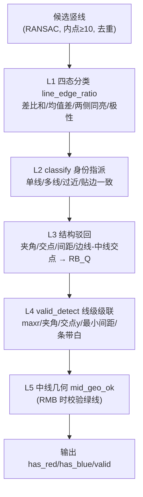

# 单边桥“PVC 视觉 → 我的视觉模块”切换卡顿问题 —— 执行规划与视觉复核报告

> 状态：**已批准并执行**（2026-08-15：变更一已实施于 `code1/wifi.c`；变更二撤销；变更三复核结论以当前工程代码为准确认，不参考任何外部代码）
> 日期：2026-08-15
> 相关文件：
> - 1 核融合门控：`code1/vision/bridge_fusion.c/.h`
> - 1 核 v8 检测器：`code1/vision/bridge_detect.c/.h`
> - 1 核仲裁/滤波：`code1/vision/bridge_v2_arbiter.c/.h`、`code1/vision/bridge_output_filter.c/.h`
> - 渲染：`code1/wifi.c`
> - 0 核控制状态机：`code/vision/vision_bridge_control.c/.h`

---

## 0. 背景与三条变更的最新状态

问题复述（用户假设）：卡顿导致“PVC 视觉 → 我的视觉模块（v8 桥上三线透视）”的切换在窗口期没有执行；窗口期过去后画面出现单边桥黑块，黑块阻止状态机切到我的视觉模块，从而在错误阶段（ref 引擎）提取出不该出现的一条线。

| # | 变更 | 本轮结论 |
|---|---|---|
| 1 | 渲染当前视觉处理模块编号 | **采纳，方案 A：白底黑字单个数字**（见 §1） |
| 2 | 门控保底进入 + 累加/衰减 | **撤销，无需修改**（确认进入门控为单帧锁存，见 §2） |
| 3 | 视觉代码复核（证明伪线非我代码所出） | **本报告 §3 即交付物（含源代码）** |

---

## 1. 变更一：渲染当前视觉处理模块编号（方案 A）

### 1.1 目标

在图传画面左上角画一个**白底黑字的数字**，表示当前单边桥融合阶段：

- `0` = 准备进入（ref 引擎，远处中线）
- `1` = 桥上（v8 引擎）
- `2` = 准备脱出（ref 引擎，脱出线）

用来逐帧确认“切换（0→1）到底发生没有、发生在第几帧”。

### 1.2 现状

`code1/wifi.c` 的 `render_bridge_vision_to_image()`（约 593–620 行）目前只画控制线与退出线，没有任何阶段编号。可复用的绘制原语已存在：

- `draw_hline_on_image()`（横向画线，可用于铺白底，`static`，`VISION_IMAGE_RENDER_ENABLE` 内）
- `draw_digit3x5_on_image()`（3×5 点阵数字，`VISION_IMAGE_RENDER_NUMERIC_ENABLE` 内）

阶段数据来源：`bridge_output_filter_get()` 返回的 `bridge_v2_arb_t.mode`（位掩码），低 3 位即阶段号，取 `arb->mode & B2M_STAGE_MASK`。`B2M_*` 宏定义在 `code/vision/vision_ipc.h`。

### 1.3 具体改动

**① 文件 `code1/wifi.c`**，在顶部 include 区增加（`B2M_STAGE_MASK` 当前不可见）：

```c
#include "vision/vision_ipc.h"
```

**② 文件 `code1/wifi.c`**，改写 `render_bridge_vision_to_image()` 开头：

```c
void render_bridge_vision_to_image(void)
{
    const bridge_v2_arb_t *arb = bridge_output_filter_get();

#if VISION_IMAGE_RENDER_ENABLE && VISION_IMAGE_RENDER_NUMERIC_ENABLE
    {
        /* 白底黑字: 当前融合阶段编号 0=准备进入(ref) 1=桥上(v8) 2=准备脱出(ref) */
        int yy;
        for (yy = 0; yy <= 6; yy++)
        {
            draw_hline_on_image(0, 6, yy, 255U);      /* 7x7 白底 */
        }
        (void)draw_digit3x5_on_image(2, 1,
                                     (uint8)(arb->mode & B2M_STAGE_MASK), 0U);
    }
#endif

    /* ……原有控制线 / 退出线绘制保持不变…… */
}
```

> 说明：位置选左上角 `(0,0)`。桥任务期间 PVC 渲染已停止（`active_target` 已切为 BRIDGE），不会与 PVC 置信度条冲突。若后续实测遮挡，可整体平移到 `(0, 8)` 或 `(0, 52)`。

### 1.4 验证

- 双核编译 0 error（`iarbuild`）。
- 实车/回放：进入单边桥任务后逐帧看左上角数字：进入前 `0`，锁存后 `1`，脱出前 `2`。若问题复现时数字一直是 `0`，直接坐实“gate_bottom 没锁”。

---

## 2. 变更二：撤销（确认进入门控为单帧锁存，无需修改）

### 2.1 事实确认

进入门控是 `code1/vision/bridge_fusion.c` 的 `bf_update_gate_bottom_ref()`（约 52–69 行），**单帧锁存**：

```c
static void bf_update_gate_bottom_ref(bf_state_t *st, const uint8_t *img,
                                      const BridgeDetectionResult *ref)
{
    float al, bl, ar, br;
    if (st->gate_bottom || !ref->bridge_found)
        return;
    if (!bf_segment_to_ab(&ref->left_segment, &al, &bl) ||
        !bf_segment_to_ab(&ref->right_segment, &ar, &br))
        return;
    if (bf_white_ratio_band(img, al, bl, ar, br,
                            BF_GATE_BOT_ROW_LO, BF_H - 1) > BF_GATE_BOT_WHITE_MIN)
        st->gate_bottom = 1;      /* 首帧满足即锁存，永不撤销 */
}
```

结论：**进入门控不是“连续 N 帧”，而是“单帧满足即锁存”**。因此不存在“缺一帧就清零连击计数”的问题，天然抗缺帧。原计划 §2 提出的“累加/衰减 + 保底进入”不适用于此，**撤销，不做任何修改**。

### 2.2 留档提示（非本次改动）

单帧锁存的剩余边界场景是：如果 ref 引擎卡顿把**整个底部白窗口期都丢掉了**（一帧白窗都没活下来），`gate_bottom` 仍可能锁不上。这是文档 `docs/任务规划/远近融合检测接入迁移规划.md` §5/D3 已记录并“已拍板不处理”的 ref 引擎耗时问题（avg 9.25ms / max 15.5ms vs ~10ms 帧周期），不属于本次变更集。若后续实车用 §1 的渲染观测确认“数字一直为 0”，再单独立项处理，**本次不动**。

---

## 3. 变更三：视觉代码复核报告（含源代码）

### 3.1 复核目标

确认：出问题视频里那根“不该出现的线”，**不可能是 v8 检测器把中线误判成边线**产出的；即“中线被严格禁止识别为边线（差比和门控）”在当前代码里是成立的。

### 3.2 边线判定总览

一条提取出来的竖线，要最终作为**红边线 / 蓝边线**进入 `b2_*`，必须穿过以下 6 层：



### 3.3 边线要求清单（逐层，含源代码）

#### 第 0 层：成线前提（`code1/vision/bridge_detect.c`）

```c
#define VLINE_MAX   4                   /* 每种符号最多提取线数           */
#define MIN_LINE_INL 10                 /* 成线最少内点                   */
#define DEDUP_DX    2.5f                /* 双线去重距离 @Y_REF            */
#define MAX_LINES   (2 * VLINE_MAX)     /* 全部竖线上限                   */
```

要求：
0. 序贯 RANSAC 拟合，内点数 `nn >= MIN_LINE_INL(10)`；
1. 同侧去重距离 `DEDUP_DX(2.5px)`；
2. 每种符号（正/负响应）最多 `VLINE_MAX(4)` 条，总量 `MAX_LINES(8)`。

#### 第 1 层：v7 四态边线判定（差比和门控核心）

常量（`code1/vision/bridge_detect.c` 约 158–183 行）：

```c
/* ---- 边线差分校验 (2026-08-14: 移植 pc_tools/bridge_v7.py 四态分类器) ----
   判定一条提取线是 边线(1) / 中线(0) / 贴边(-1) / 不可判(2):
   全行分 V7_SEG 段, 两侧带 (x-11..x-6 / x+6..x+11) 一次矩均值;
   双峰清晰时: 两侧同亮(>mid_ref) → 中线证据; 两侧同暗且接近 → 中性;
   边线证据: 差比和 d*100 > 30*(mi+mo) 或 均值差 d > 18;
   边线认定: >50% 有效段支持 且 沿线 gx 主导极性匹配;
   外侧全段出画 → 贴边; 极性明确相反 → 不可判。 ---- */
#define V7_SEG       6                   /* v7 分类器分段数 (每段10行)     */
#define V7_RATIO_PER 30.0f               /* 宽松差比和阈值 (%)             */
#define V7_MEAN_DIFF 18.0f               /* 宽松均值差阈值                 */
#define V7_SEG_MAJ   50                  /* 边线认定: >50% 有效段支持      */
#define V7_MIN_FLANK 40                  /* 外侧带最少样本数, 否则贴边     */
#define V7_POL_THR   200.0f              /* 极性强点阈值下限 (动态: max(此, 0.5*p90|gx|)) */
#define V7_POL_MIN_N 3                   /* 极性最少有效采样点             */
#define V7_POL_MAJOR 80                  /* 主导极性占比下限 (%)           */
#define EDGE_UNKNOWN 2                   /* 四态之"不可判"                 */
#define EDGE_MARGIN 10.0f               /* 边框伪线判定边距               */
```

极性采样（`gx_polarity`，约 629–655 行）：

```c
static int gx_polarity(float a, float b)
{
    int pos = 0, neg = 0, y;
    for (y = 0; y < GH; y += 2) {
        float x_orig = a * ((float)y + 1.5f) + b;
        int gxx = rnd_he(x_orig - 1.5f);
        int g;
        if (gxx < 0 || gxx >= GW)
            continue;
        g = s_gx[y][gxx];
        if ((float)g > s_pol_thr)
            pos++;
        else if ((float)g < -s_pol_thr)
            neg++;
    }
    if (pos + neg < V7_POL_MIN_N)
        return 0;
    if (pos * 100 >= (pos + neg) * V7_POL_MAJOR)
        return 1;
    if (neg * 100 >= (pos + neg) * V7_POL_MAJOR)
        return -1;
    return 0;
}
```

四态判定（`line_edge_ratio`，约 656–720 行）：

```c
static int line_edge_ratio(const iline_t *L, int side)
{
    int k, s, y;
    int edge_cnt = 0, valid_seg = 0, outer_n = 0, any_bright = 0;
    float mid_ref = (s_bref_lo + s_bref_hi) * 0.5f;
    for (s = 0; s < V7_SEG; s++) {
        int y0 = s * H / V7_SEG, y1 = (s + 1) * H / V7_SEG;
        int ls = 0, rs = 0, lc = 0, rc = 0;
        for (y = y0; y < y1; y++) {
            int x = (int)(L->f.a * (float)y + L->f.b);
            for (k = 0; k < 6; k++) {
                int xl = x - 11 + k, xr = x + 6 + k;   /* 两侧带, 间隔2px */
                if (xl >= 0 && xl < W) { ls += s_img[y][xl]; lc++; }
                if (xr >= 0 && xr < W) { rs += s_img[y][xr]; rc++; }
            }
        }
        outer_n += (side < 0) ? lc : rc;
        if (lc >= 6 && rc >= 6) {
            float mi = (float)ls / lc;      /* 左带均值 */
            float mo = (float)rs / rc;      /* 右带均值 */
            float d = fabsf(mi - mo);
            valid_seg++;
            if (s_bref_sep) {
                /* ① 两侧同亮(>双峰分界) → 中线证据, 后置判定 */
                if (mi > mid_ref && mo > mid_ref) { any_bright = 1; continue; }
                /* ② 两侧同暗且接近 → 中性 */
                if (mi < mid_ref && mo < mid_ref && d <= V7_MEAN_DIFF) continue;
            }
            /* ③ 边线证据: 差比和 OR 均值差 (相对曝光不变) */
            if (d * 100.0f > V7_RATIO_PER * (mi + mo) || d > V7_MEAN_DIFF)
                edge_cnt++;
        }
    }
    {
        int want = (side < 0) ? 1 : -1;
        int pol = gx_polarity(L->f.a, L->f.b);
        /* ④ 任一段两侧同亮 → 强制中线 */
        if (any_bright)
            return 0;
        /* ⑤ 边线认定: 过半有效段支持 且 极性匹配 */
        if (valid_seg >= 1 && edge_cnt * 100 > valid_seg * V7_SEG_MAJ &&
            pol == want)
            return 1;
        /* ⑥ 贴边: 外侧全段出画 */
        if (outer_n < V7_MIN_FLANK)
            return (pol == want || pol == 0) ? -1 : EDGE_UNKNOWN;
        return EDGE_UNKNOWN;
    }
}
```

本层边线要求（一条线要拿到 `1=边线`）：

1. 全行按 `V7_SEG(6)` 分段，逐段统计左右两侧带（`x-11..x-6` / `x+6..x+11`，间隔 2px）一次矩均值 `mi/mo`；
2. 双峰参考清晰（`s_bref_sep`）时，**任一段两侧同亮（`mi>mid_ref && mo>mid_ref`）→ 立即判定为中线**（`any_bright`，第 ④ 条强制返回 0）；
3. 两侧同暗且接近（`d<=18`）的段不计边线证据；
4. 边线证据必须满足**差比和** `d*100 > 30*(mi+mo)` **或** 均值差 `d > 18`；
5. 有效段中支持边线证据的比例必须 `>50%`（`V7_SEG_MAJ`）；
6. 沿线 gx 主导极性必须与目标侧一致（红=+1 暗→亮，蓝=-1 亮→暗），且样本 `≥3`、主导占比 `≥80%`；
7. 外侧带样本数 `< V7_MIN_FLANK(40)` 时判为贴边 `-1` 或不可判 `2`。

#### 第 2 层：`classify` 身份指派

单线（`classify` 中 `n==1` 分支）：

```c
        pol = gx_polarity(L->f.a, L->f.b);
        if (pol == 1 && mr > ml + 8.0f) { *ir = 0; return BRIDGE_MODE_R; }
        if (pol == -1 && ml > mr + 8.0f) { *ib = 0; return BRIDGE_MODE_B; }
        *ig = 0; return BRIDGE_MODE_M;
```

多线过近分支（`pair_too_close` → 侧线+中线处理）：

```c
        if (pair_too_close(&s_lines[bi], &s_lines[bj], prior)) {
            int le = line_edge_status(&s_lines[bi], -1);
            int re = line_edge_status(&s_lines[bj], +1);
            if ((le == 1 || le == -1) && xs[bi] < EDGE_MARGIN &&
                xs[bj] < W - EDGE_MARGIN) { *ib = bj; return BRIDGE_MODE_B; }
            if (le == EDGE_UNKNOWN || re == EDGE_UNKNOWN) { /* 部分指派或 NONE */ }
            if (le == 0) { *ig = bi; *ib = bj; /* 推断红 */ return BRIDGE_MODE_MB; }
            if (re == 0) { *ir = bi; *ig = bj; /* 推断蓝 */ return BRIDGE_MODE_RM; }
            *ir = bi; *ib = bj; return BRIDGE_MODE_RB_Q;
        }
```

正常分支：

```c
        {
            int le = line_edge_status(&s_lines[bi], -1);
            int re = line_edge_status(&s_lines[bj], +1);
            int le_e, re_e;
            if (le == -1 && xs[bi] < EDGE_MARGIN &&
                xs[bj] < W - EDGE_MARGIN) { *ib = bj; return BRIDGE_MODE_B; }
            if (le == EDGE_UNKNOWN || re == EDGE_UNKNOWN) { /* 部分指派或 NONE */ }
            le_e = (le == 1 || le == -1);
            re_e = (re == 1 || re == -1);
            if (!le_e && re_e) { *ig = bi; *ib = bj; return BRIDGE_MODE_MB; }
            if (le_e && !re_e) { *ir = bi; *ig = bj; return BRIDGE_MODE_RM; }
            if (!le_e && !re_e) return BRIDGE_MODE_NONE;
        }
        /* 都是边线 → RB; 线对之间找满足几何约束的中线 → RMB */
        *ir = bi; *ib = bj; *sp_out = bs;
        for (j = bi + 1; j < bj; j++) {
            if (mid_geo_ok(&s_lines[bi], &s_lines[j], &s_lines[bj])) {
                *ig = j; break;
            }
        }
        return (*ig >= 0) ? BRIDGE_MODE_RMB : BRIDGE_MODE_RB;
```

本层边线要求：

8. 单线要当边线，必须同时满足“相对亮度差”与“极性”（红：`pol==+1 && mr>ml+8`；蓝：`pol==-1 && ml>mr+8`），否则降级为中线 `M`；
9. 多线按间距先验选红蓝候选对（有先验取最接近，无先验取最宽）；
10. `pair_too_close`：`Y_REF` 处间距 `< W_PRIOR_LO(0.70)×先验` → 判“中线+边线”，只有四态明确为 `0=中线` 的线才作中间线；两边线贴边组合 → `RB_Q`；
11. 贴边一致性：贴左边框的“R” + 画面内“B” → 只出 B（滤边框伪线）；
12. 正常分支必须两线四态都判边线（YES/TIGHT）才 `RB`；一界一中 → `RM/MB`；都不是 → `NONE`；`UNKNOWN` → 仅部分指派。

#### 第 3 层：结构驳回（`bridge_detect_frame` 尾部，约 3056–3082 行）

```c
    /* v11 错误线条驳回 → mode=RB_Q(结构错误), 边线不渲染。
       ① 红蓝夹角/交点几何不合理  ② 边线先验距离: 左右边线 Y_REF 间距过近 */
    ...
            xr - xl < MIN_SPACING)
            mode = BRIDGE_MODE_RB_Q;
    /* v11 边线-中线交点驳回 → mode=RB_Q(结构错误): */
    ...
            mode = BRIDGE_MODE_RB_Q;
    ...
    if (mode == BRIDGE_MODE_RB_Q) { ... 边线置空 ... }
```

本层边线要求：

13. 红蓝夹角 / 交点几何不合理 → `RB_Q`，边线置空；
14. 左右边线 `Y_REF` 间距过近（`< MIN_SPACING(14)`）→ `RB_Q`；
15. v11 边线-中线交点驳回（交点 `y_i > 30` 且在图内）→ `RB_Q`。

#### 第 4 层：`valid_detect` 线级级联（约 800–870 行）

```c
#define VALID_MXR     0.35f              /* 边线原图亮度差(4段二次矩差比和)下限 */
#define VALID_ANGLE   90.0f              /* 线对夹角上限 */
#define VALID_YC      30.0f              /* 线对交点(靠近点)行坐标上限 */
#define VALID_WMIN    15.0f              /* 线对最小间距下限 */
#define VALID_STRIP_W 0.5f               /* 边线包裹区最大条带近白比例下限 */
#define VALID_NSTRIP  12                 /* 条带白分带数 */
#define VALID_WHITE   200                /* 近白像素灰度阈值 */
```

```c
static int valid_detect(const bridge_line_t *red, const bridge_line_t *green,
                        const bridge_line_t *blue)
{
    ...
    if (!has_r && !has_b) return 0;      /* 无边线 (含纯绿线) */
    if (has_r && has_b) { l1 = red; l2 = blue; }
    else if (has_g)     { l1 = has_r ? red : blue; l2 = green; }
    else                 return 0;       /* 仅单边线, 无中线可配对 */
    ...
    if (has_r && line_maxr_val(red, -1) <= VALID_MXR) return 0;
    if (has_b && line_maxr_val(blue, +1) <= VALID_MXR) return 0;
    /* 夹角 → 靠近点 → 间距 → 白带 */
    ...
    if (ang > VALID_ANGLE) return 0;
    ...
    if (yc > VALID_YC) return 0;
    ...
    if (wmin < VALID_WMIN) return 0;
    ...
    if (mxw <= VALID_STRIP_W) return 0;
    return 1;
}
```

本层边线要求（决定 `b2_valid`）：

16. 必须存在边线（无边线 / 纯绿线 → 无效）；
17. 每条边线的亮度差 `line_maxr_val`（4 段二次矩差比和最大值）必须 `> 0.35`；
18. 线对夹角 `≤ 90°`；
19. 线对交点（靠近点）行坐标 `y_c ≤ 30`（交点须在画面上方远处）；
20. 线对最小间距 `≥ 15px`；
21. 边线包裹区最大条带近白比例 `> 0.5`。

#### 第 5 层：`mid_geo_ok` 中线几何（约 865–898 行）

```c
#define PAR_A_TOL    0.15f               /* G 斜率与 R/B 中位斜率最大偏差 */
#define MID_R_LO     0.35f               /* 中线间距比带                   */
#define MID_R_HI     0.65f
```

```c
static int mid_geo_ok(const iline_t *red, const iline_t *mid, const iline_t *blue)
{
    ...
    if (fabsf(mid->f.a - (red->f.a + blue->f.a) * 0.5f) > PAR_A_TOL)
        return 0;                        /* G 斜率偏离 R/B 中位 → 否决绿线 */
    for (t = 0; t < 3; t++) {
        ...
        r = (mid->f.a * y + mid->f.b - xl) / w;
        if (r < MID_R_LO || r > MID_R_HI) return 0;
        ...
    }
    return checked > 0;
}
```

本层要求（RMB 模式的中线，防止中线/边线身份混淆）：

22. 中线斜率偏离红蓝斜率中位 `≤ 0.15`（三线共消失点）；
23. 支撑范围内中线间距比 `∈ [0.35, 0.65]`。

### 3.4 严格禁止“中线被识别为边线”的机制（差比和门控）

核心结论：**中线两侧都是亮桥面，边线一侧亮一侧暗。程序利用这个几何/灰度本质差异，用三层机制叠加，把中线挡在“边线”门外。**

#### 机制 ① 差比和门控（相对曝光不变）

```c
            if (d * 100.0f > V7_RATIO_PER * (mi + mo) || d > V7_MEAN_DIFF)
                edge_cnt++;
```

- 对中线：左右两侧带都在白色桥面内 → `mi ≈ mo`（都接近亮值）→ `d = |mi-mo| ≈ 0` → 差比和 `d/(mi+mo) ≈ 0`，远小于 30%；均值差 `d` 也远小于 18。**边线证据计数永远不涨。**
- 对真边线：外侧是暗地面/暗背景、内侧是亮桥面 → `d` 大、`d/(mi+mo)` 大 → 超过 30%（或 `d>18`）→ 计入边线证据。
- “差比和”用 `(mi+mo)` 归一化，**不依赖绝对曝光**：暗帧里 `mi/mo` 整体偏低，但比值关系不变，因此暗场景下仍有效。

#### 机制 ② 任一段两侧同亮 → 强制中线（一票否决）

```c
                /* ① 两侧同亮(>双峰分界) → 中线证据 */
                if (mi > mid_ref && mo > mid_ref) { any_bright = 1; continue; }
            ...
        /* ④ 任一段两侧同亮 → 强制中线 */
        if (any_bright)
            return 0;
```

- 只要 6 段中有**任意一段**两侧带都亮于双峰分界（`mid_ref`），整条线直接判为中线 `0`，**不管其它段有没有边线证据**。
- 真边线的一侧是暗的，不可能出现“两侧同亮”，因此这一条对真边线零误伤、对中线零放过。

#### 机制 ③ 极性匹配兜底

```c
        int want = (side < 0) ? 1 : -1;
        int pol = gx_polarity(L->f.a, L->f.b);
        ...
        if (valid_seg >= 1 && edge_cnt * 100 > valid_seg * V7_SEG_MAJ &&
            pol == want)
            return 1;
```

- 沿线水平梯度 `gx` 的主导极性必须匹配目标侧：左界（红）须 `+1`（暗→亮），右界（蓝）须 `-1`（亮→暗），且样本 `≥3`、主导占比 `≥80%`。
- 中线两侧都亮，沿线几乎没有持续单方向的强梯度 → `gx_polarity` 返回 0 或不符合 → 即使差比和偶发通过，也因极性不匹配被拒。

#### 汇总：中线成为“红/蓝边线”需要同时被否决多少次

一条真实的中线要“错误地被当成边线”，必须**同时突破**：

- 第 1 层：差比和 `>30%` 或均值差 `>18`，且 `>50%` 段支持，且 `any_bright==0`，且极性匹配 —— 对“两侧同亮”的中线，②③ 直接封死；
- 第 2 层：单线要相对亮度差+极性双过；多线要两线四态都判边线（中线会被判 `0` 而落到 `RM/MB/NONE`）；
- 第 4 层：边线亮度差 `maxr>0.35`（中线二次矩差比小，过不了）。

### 3.5 复核结论

1. 当前程序对“红/蓝边线”的要求共 **6 层、约 24 项**（§3.3 第 0~5 层）。
2. “中线被识别为边线”被**差比和门控 + 两侧同亮强制中线 + gx 极性匹配**三层机制严格禁止；在“桥面两侧亮”的物理前提下，中线几乎不可能通过第 1 层四态判定拿到 `1=边线`。
3. 因此，出问题视频中那根“不该出现的线”，**大概率不是 v8 检测器把中线误判为边线产生的**；与用户“我的视觉模块有专门处理侧边情况、且实测有效”的判断一致。伪线更可能来自**错误阶段跑 ref 引擎**（卡在准备进入，ref 在桥面黑块上拟合出伪中线）。
4. 建议后续复核动作（审批后执行，作为证据闭环）：用 PC 对拍把出问题帧分别喂 `bridge_detect_frame`（v8）与 `bridge_detection_detect_gray`（ref），对比两者是否出线，即可最终锁定伪线来源。

---

## 4. 实施顺序与门禁（更新后）

| 步骤 | 内容 | 出口门禁 |
|---|---|---|
| S0 | 记录 git 分支/commit 回滚点；双核 `iarbuild` 留 0 error 基线 | 基线固化 |
| S1 | 变更一：渲染白底黑字阶段号（§1） | 双核 0 error；录像可看到 0/1/2 |
| S2 | 变更三收尾：PC 对拍复现伪线来源（§3.5-4，审批后） | 复核记录定稿 |
| S3 | 实车/回放全链路验证（SBUS 侧键触发单边桥） | 用 §1 数字确认 0→1→2 正常，无 FAILSAFE |

说明：变更二已撤销，不再有代码步骤。

---

## 5. 待审批确认清单

1. 变更一：是否按 §1 的白底黑字（左上角 `(0,0)`，单数字 0/1/2）执行？
2. 变更二：确认**撤销、不改动**（进入门控为单帧锁存）？
3. 变更三：本报告 §3 的“边线要求清单 + 差比和门控”结论是否认可？是否需要我把 §3.5-4 的 PC 对拍复现也纳入本轮实施？
4. 本文件定稿后，是否继续等 S1/S2/S3 逐步审批，还是一并批准后开工？
