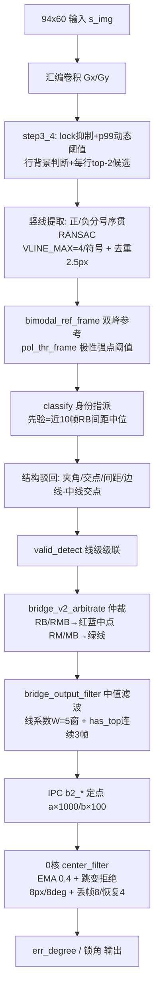

# 单边桥 v8 引擎“错误边线（中线画在边线与中线之间）”全链路审查

> 状态：**分析报告**（假设前提：该错误边线确由 v8 引擎产出）
> 日期：2026-08-15
> 审查范围：从 94×60 输入图像 → v8 检测器 → 仲裁层 → 中值滤波层 → IPC → 0 核控制滤波，全部纳入，含帧级别跳边。

---

## 0. 结论（先给）

**v8 引擎确实存在多条可复现的路径，能产出“画在真边线与真中线之间的错误线”。** 它不是某一个单点 bug，而是四个结构性因素叠加：

1. **身份判定逐帧独立**：`classify()` 每帧重新决定“哪条线是红/绿/蓝”，**没有任何跨帧身份一致性约束**。
2. **间距先验可被污染**：`sp_buf[10]` 中位先验只由 RB/RMB 帧喂，且记账发生在 `valid_detect` 之前，**`valid=0` 的错误 RB/RMB 帧（由伪亮度边构成）仍会污染先验**，进而反哺下一帧的候选对选择。注：RB/RMB 要求两线都过差比和 + 极性，"两侧同亮"的中线不可能被误判为红蓝边线。
3. **中值滤波只滤系数、不滤身份**：`source/mode` 直通不滤；同源但物理线跳变时不清窗，会把两条物理线的系数混成“中间合成线”。
4. **0 核防跳只挡 1 帧**：`CENTER_JUMP` 拒绝只有 1 帧确认，且它滤的是控制测量量，不是线身份。

---

## 1. 全链路地图



---

## 2. 逐级审查

### L0 提取层（`extract_sign_lines` / `ransac_best` / `step3_4_dyn_threshold`）

关键参数：

```c
#define MIN_INLIERS 4                   /* RANSAC 最少内点                */
#define INLIER_TOL  1.5f                /* 内点容差 (px)                  */
#define RANSAC_ITER 40                  /* 40~150 零质量损失, 20 出现假线  */
#define SLOPE_MAX_V 2.5f                /* 竖线斜率上限                   */
#define VLINE_MAX   4                   /* 每种符号最多提取线数           */
#define DEDUP_DX    2.5f                /* 双线去重距离 @Y_REF            */
#define Q_P99       0.3f                /* 阈值 = Q_P99 · p99             */
#define T_FLOOR     300.0f              /* 动态阈值下限                   */
#define ROW_OK_MIN  12                  /* 有效行<12 时降级为全行有效     */
```

**可产出错误线的机制：**

- **假线直接来自 RANSAC**：注释明写 `RANSAC_ITER 20 出现假线`，当前 40 是“质量/耗时折中”，不是“零假线”。桥面纹理、阴影、护栏反光只要在竖方向凑够 4 个内点、容差 1.5px，就能被拟合出一条假竖线。
- **去重间距 2.5px 太小**：`merge_lines` 只合并 `x@Y_REF` 相邻 < 2.5px 的线。真边线与伪线只要间隔 ≥3px 就并存，共同进入 `classify`。
- **行背景降级**：整帧有效行 < `ROW_OK_MIN(12)` 时 `s_row_ok` 全置 1，本来该被行背景判断滤掉的杂乱行全部入队 → 伪线候选变多。
- **动态阈值逐帧独立**：`thr = 0.3×p99(|gx|)`（下限 300）每帧重算。帧间亮度/纹理变化会让“哪些像素过阈”变化 → 候选点集变化 → 同一条物理线的内点数、甚至存在性逐帧抖。

### L1 分类层（`classify`，身份指派）—— 核心嫌疑区

候选红蓝对选择（`classify` 多线分支）：

```c
        for (i = 0; i < n; i++) {
            for (j = i + 1; j < n; j++) {
                float s = xs[j] - xs[i], sc;
                if (s < 4)
                    continue;
                sc = (prior > 0) ? fabsf(s - prior) : -s;
                if (bi < 0 || sc < best_sc) { best_sc = sc; bi = i; bj = j; bs = s; }
            }
        }
```

- **有先验（prior>0）时，选“间距最接近 prior”的那一对**，而不是“最像真红蓝”的那一对。
- **无先验（prior=0）时，选“间距最大”的那一对**（`sc = -s` 取最小）。

过近判定（`pair_too_close`）：

```c
#define W_PRIOR_LO      0.70f   /* 间距 < LO*w(y) → 中线 */
```

**用几何例说清楚“中线画在边线与中线之间”是怎么来的**（画面 94px，Y_REF=55）：

| 物理线 | x@Y_REF |
|---|---|
| 真红（左界） | 20 |
| 伪线（纹理/阴影） | 35 |
| 真绿（中缝） | 47 |
| 真蓝（右界） | 74 |

- 正常：classify 选 (20,74)=RB，绿=47 → 红蓝中点 ≈ 47。
- **错误路径 A（RM/MB 中线直出）**：候选对错选成 (20,47) 或 (20,35)。因 47/35 都被差比和 + `any_bright` 正确判为“中线”，(20,中线) 落成 `RM` → 控制线直接输出该“中线”，且 **不经过 `mid_geo_ok` 对称性校验**。当选成 (20,35) 时，控制线画在 35，即“真边线(20) 与 真中线(47) 之间”。
- **错误路径 B（RB/RMB 选中“伪亮度边”）**：若 35 处本身是一条真实亮度边（阴影/反光边界，一侧亮一侧暗），它能通过差比和 + 极性 → classify 选 (20,35) 或 (35,74) 为 `RB` → 红蓝中点落在错误位置。这是唯一能造成“红蓝身份本身错”的情形，且它不违反差比和门控（该伪线确有亮度差）。

单线分支（`n==1`）：

```c
        if (pol == 1 && mr > ml + 8.0f) { *ir = 0; return BRIDGE_MODE_R; }
        if (pol == -1 && ml > mr + 8.0f) { *ib = 0; return BRIDGE_MODE_B; }
        *ig = 0; return BRIDGE_MODE_M;
```

- 单线时只用“两侧带相对亮度差 >8 + 极性”判 R/B，不校验它与先验间距的关系。**桥面中缝一侧若因反光/阴影出现亮度差，单线会被判成边线**。

### L2 结构驳回层（`line_angle_ok` / `edge_mid_cross_bad`）

```c
static int line_angle_ok(const bridge_line_t *lf, const bridge_line_t *rf) { ... yi >= V8_INT_Y → 驳回; atan2f>0 → 驳回 ... }
static int edge_mid_cross_bad(const bridge_line_t *ef, const bridge_line_t *mf) { ... yi > V11_MID_INT_Y && yi < H → 驳回 ... }
```

- 这些驳回在“红蓝都在 / 边线-中线都在”时才触发，且是几何约束（夹角、交点）。**伪线如果恰好在几何上“合理”（斜率与真线近似平行、交点远在上方），就能绕过全部结构驳回。**

### L3 有效检测层（`valid_detect`）

```c
    if (has_r && line_maxr_val(red, -1) <= VALID_MXR) return 0;
    if (has_b && line_maxr_val(blue, +1) <= VALID_MXR) return 0;
    ... ang > VALID_ANGLE → 0; yc > VALID_YC → 0; wmin < VALID_WMIN → 0; mxw <= VALID_STRIP_W → 0;
```

- 只校验“边线亮度差 / 夹角 / 交点 / 最小间距 / 包裹白带”，**不校验“中线是否在红蓝正中间、身份是否与上一帧一致”**。
- 关键：`out->valid` 是帧末才算，**而先验记账（下一步）已经发生在它之前**。

### L4 帧间时序层（先验自校准 + 身份跳变）—— 用户重点“帧级别跳边”

先验记账（`bridge_detect_frame` 步骤 7，发生在 `valid_detect` 之前）：

```c
    if ((mode == BRIDGE_MODE_RB || mode == BRIDGE_MODE_RMB) && spacing > 0 &&
        ir >= 0 && ib >= 0) {
        float xr = s_lines[ir].f.a * Y_REF + s_lines[ir].f.b;
        float xb = s_lines[ib].f.a * Y_REF + s_lines[ib].f.b;
        if (xr >= 2.0f && xr <= W - 3.0f && xb >= 2.0f && xb <= W - 3.0f) {
            st->sp_buf[st->sp_head] = spacing;      /* 喂间距 */
            ...
            wp_calibrate_frame(st, &s_lines[ir], &s_lines[ib]);  /* 喂自校准 */
        }
    }
```

**污染路径（重要）**：
1. classify 把“伪亮度边（阴影/反光边界）+ 真边线”判成 RB/RMB（两线都过了差比和 + 极性，因此能通过 L2 几何驳回）；
2. 本帧 `out->valid` 还没算，先验记账已执行 → **这个错误 RB/RMB 对的间距进入 `sp_buf[10]` 和 `wp_a/wp_b` 自校准**；
3. 下一帧 `prior = sp_buf 中位` 被带偏 → 候选对选择 `fabsf(s-prior)` 更倾向选错对 → **错误身份被“锁定放大”**。

> 注：`sp_buf` 只由 RB/RMB 帧喂；RM/MB（一界一中）不喂先验。所以 RM/MB 路径本身不污染先验，污染源头是“伪亮度边构成的错误 RB/RMB”。

**身份跳变（跳边）的定义**：没有任何结构体记录“x≈20 这条线上一帧是红”，所以：

- 帧 N：x=20 被判红、x=47 判绿、x=74 判蓝；
- 帧 N+1：x=20 漏提（RANSAC 内点不够/被行背景滤掉），classify 改判 x=35(伪) 为红、x=47 为绿、x=74 为蓝 → **同一“红边线”身份从物理线 20 跳到 35**，控制线瞬时右移。

这是**逐帧独立分类的必然结果**，不是 bug，是设计上没有“身份连续性”约束。

### L5 仲裁层（`bridge_v2_arbitrate`）

```c
    case BRIDGE_MODE_RB:
    case BRIDGE_MODE_RMB:
        out->valid = 1; out->source = 0;
        out->line = (red + blue) * 0.5;      /* 红蓝中点 */
        ...
    case BRIDGE_MODE_RM:
    case BRIDGE_MODE_MB:
        out->valid = 1; out->source = 1;
        out->line = green;                    /* 绿线直出 */
```

- 仲裁把“身份”压缩成一条控制线 + `source`。**RB↔RM 的身份翻转在这里表现为 `source` 0↔1 跳变**。
- 错误边线若以 RM/MB 形式存在（伪线当绿、真边线当 R），仲裁直接输出伪绿线，没有任何二次校验。

### L6 中值滤波层（`bridge_output_filter`）—— 第二个重点

```c
    s_f.filtered = *raw;                     /* valid/source/mode/gate 全直通 */
    if (raw->source != s_f.last_source) { win_clear(&s_f.line); s_f.last_source = raw->source; }
    win_push(&s_f.line, raw->line_a_x1000, raw->line_b_x100, raw->valid);
    nv = win_valid_count(&s_f.line);
    if (raw->valid && nv >= BRIDGE_FILTER_MIN_VALID) {
        s_f.filtered.line_a_x1000 = win_median(&s_f.line, 0);
        s_f.filtered.line_b_x100  = win_median(&s_f.line, 1);
    }
```

关键事实：

1. **`valid/source/mode/gate/u_lo/u_hi` 全部直通**，只有 `line_a/line_b` 和 `top/has_top` 被滤波。**身份（mode/source）是当前帧的，不滤波。**
2. **同源不清窗**：只要 `source` 不变（例如 RB→RB，但“红”物理线从 20 跳到 35），5 帧窗口不清，中值会把旧线(20)和新线(35)的系数混在一起，输出一个**不对应任何物理线的“中间合成线”** —— 这正是“中线画在边线和中线中间”的另一种直接成因。
3. **跨源清窗**：RB↔RM（source 0↔1）切换时清窗，但清窗后新线是**原样直出**（前几帧无中值保护），跳边瞬间无缓冲。

### L7 IPC 层（定点量化）

```c
    packet->b2_line_a_x1000 = arb->line_a_x1000;   /* a×1000, int16 */
    packet->b2_line_b_x100  = arb->line_b_x100;    /* b×100,  int16 */
```

- 定点量化本身只引入 ≤0.5px 误差，**不是错误边线的根因**，但会与跳边叠加，放大“线在帧间的小幅漂移”。

### L8 0 核控制滤波层（`vision_bridge_update_center_filter`）

```c
    /* C09: 失能连续 N 帧才回锁角; 恢复连续 M 帧有效才回视觉 */
    if (packet->b2_valid == 0U || 测量无效) { lost++; ≥8 → center_filter_valid=0; return; }
    ...
    is_jump = |lookahead_x - filtered| > 8px 或 |heading - filtered| > 8deg;
    if (is_jump) { pending_jump 确认1帧(±3px/±3deg) 否则丢弃; }
    filtered += 0.40 * (lookahead - filtered);   /* EMA */
```

**现有防护为什么不挡“错误边线”**：
- 它滤的是**控制测量量**（前视行 y=25 处的 x 和 heading），不是线身份。
- 跳变拒绝只有 **1 帧确认**：错误边线只要连续出现 2 帧就通过。
- 错误边线经过 1 核中值滤波后通常是**平滑的**（见 L6），0 核的 8px/8deg 阈值可能根本不触发。
- EMA(0.4) 是跨源连续平滑，换源只靠 `err_ramp` 限速（0.5°/2ms），**不隔离错误源**。

---

## 3. 帧级别跳边专项分析

### 3.1 跳边是什么

相邻两帧之间，**同一个身份（红/绿/蓝）被指派给不同的物理线**。这是逐帧独立 `classify` + 无身份连续性约束的直接结果。

### 3.2 跳边的触发点（按概率）

| # | 触发点 | 机制 |
|---|---|---|
| 1 | 候选对选择 `sc=fabsf(s-prior)` | prior 被污染后，最接近 prior 的“对”变成错误对 |
| 2 | `pair_too_close` 用 prior | prior 偏大 → 真红蓝被判“过近” → 真边线降级、伪线提升 |
| 3 | RANSAC 假线 + 去重 2.5px | 伪线以独立身份进入 classify，候选集多一条 |
| 4 | 行背景降级 `ROW_OK_MIN` | 有效行<12 → 全行有效 → 伪线候选暴增 |
| 5 | 动态阈值逐帧漂移 | 帧间过阈像素变化 → 某条真线内点不足被漏提 |

### 3.3 现有防护为什么挡不住

| 防护 | 为什么挡不住 |
|---|---|
| 中值滤波（1核） | 只滤线系数、不滤身份；同源跳变反而混出“合成线” |
| `has_top` 连续3帧 | 只管退出线，不管竖线身份 |
| 0核跳变拒绝 8px/8deg | 1 帧确认；滤的是测量量非身份；中值已把跳变抹平 |
| EMA 0.4 | 平滑但不拒绝，错误源持续 2+ 帧即收敛到错误值 |
| `valid_detect` | 帧级几何校验，不校验身份连续性，且发生在先验记账之后 |

---

## 4. 高风险路径排序（最可能产生“错误边线”）

1. **RM/MB 中线直出**（L1/L5）：候选对错选成 (真边线, 伪中线)，伪中线被正确判为中线、却作为控制线直接输出（不经过 `mid_geo_ok`）→ 控制线画在“边线与中线中间”。**最符合该现象。**
2. **先验污染 → 候选对错选**（L4 + L1）：伪亮度边构成的错误 RB/RMB 喂 `sp_buf`（发生在 `valid_detect` 之前）→ 下一帧 `fabsf(s-prior)` 选错对 → 错误身份持续锁定。
3. **身份逐帧跳变**（L4）：无身份连续性约束，漏提/多提一条线即跳边。
4. **中值滤波同源不清窗**（L6）：source 不变但物理线跳变时，混出“不对应任何物理线的中间线”。
5. **提取层假线**（L0）：RANSAC 40 次 + 行背景降级 + 2.5px 去重，伪线候选天然存在。

---

## 5. 证据化验证建议（不改代码，用现有 PC 对拍/回放确认）

1. **逐帧导出 v8 内部状态**：在 PC host（`tools/07_针对小车车载视频的cv算法/bridge2/c_bridge2/`）里对出问题视频逐帧打印 `mode / ir / ig / ib / xs[] / prior / spacing / valid`，定位“错误边线”是哪一帧、哪对线被选为 RB。
2. **对拍 prior 污染**：把该帧之前的 `sp_buf` 历史打出来，确认是否有 `valid=0` 的错误 RB 帧喂了先验。
3. **对拍中值窗**：同源跳变帧前后各 2 帧的 `line_a/b`，确认中值是否混出中间线。
4. **复现条件最小化**：对出问题帧单独回放，看是否需要前几帧的“先验污染”才会复现（如果单帧不复现、连续帧复现 → 坐实时序/先验问题）。

> 若上述任一验证坐实，对应修复方向（另立项，不在本次变更范围）：
> - 给 `sp_buf` 记账加 `out->valid` 前置条件（把记账移到 `valid_detect` 之后）；
> - `classify` 增加跨帧身份连续性约束（对上一帧 R/G/B 的 x 做最近邻绑定）；
> - 中值滤波按“线身份/线序号”而非“source”清窗；
> - 0 核跳变拒绝改为连续 2~3 帧确认。
