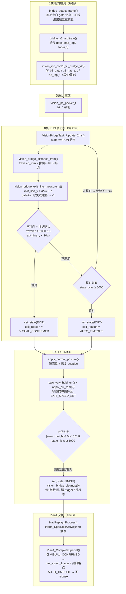

# 单边桥脱出（EXIT）判定逻辑详解

> 代码依据：`code/vision/vision_bridge_control.c`（0核状态机）、`code/vision/vision_bridge_control.h`（阈值）、
> `code1/vision/bridge_detect.c` / `bridge_v2_arbiter.c` / `vision_ipc_core1.c`（1核检测与仲裁）、
> `code/navigation/nav_replay/plan4/plan4_lqr_speed_planning.c`（Plan4 交接）。
> 对应 AGENTS.md 的 **C6 出口判定**。

---

## 0. 一句话总览

**RUN 阶段每 2ms 判定一次“是否已走到桥尾”：主判定＝里程门 + 退出线视觉确认（`VISUAL_CONFIRMED`），兜底＝超时（`AUTO_TIMEOUT`）。确认后进入 EXIT 下桥缓冲 → FINISH 交还 → Plan4 只对 `VISUAL_CONFIRMED` 做融合坐标 rebase。**

脱出链路跨两个核：

```
1核: bridge_detect_frame → bridge_v2_arbitrate → vision_ipc_core1_fill_bridge_v2
      (退出线检测)         (仲裁透传)             (写共享包 b2_*)
IPC:  vision_ipc_packet_t (b2_gate / b2_has_top / b2_top_a_x1000 / b2_top_b_x100)
0核:  VisionIpc_Core0_GetLatest → VisionBridgeTask_Update_2ms (RUN 分支)
      → vision_bridge_distance_from → vision_bridge_exit_line_measure_y
      → vision_bridge_exit_line_confirmed → set_state(EXIT)
      → apply_normal_posture / calc_yaw_hold_err / apply_err_ramp
      → set_state(FINISH) → vision_bridge_cleanup(0)
Plan4: NavReplay_Process → Plan4_SpecialIsActive()==0 → Plan4_CompleteSpecial (rebase 出口路点)
```

---

## 1. 全链路 Mermaid 流程图



---

## 2. 逐函数讲解（自底向上）

### 2.1 1核：退出线信号是怎么产生的

#### `bridge_detect_frame()`（`code1/vision/bridge_detect.c`）
- 退出线＝**桥远端上沿线**（粉色线），与旧管线 `up_line` 是同一物理线、同一 94×60 图像坐标系。
- 检测前置条件（`#if TOP_GRAD` 分支，RANSAC 法）：
  1. **gate 锁存**：图像底部 `GATE_ROWS=52` 以下变白 → `st->gate=1`，锁存后不撤销；
  2. **红、蓝边线都在**（`ir>=0 && ib>=0`）。
- 通过**五重校验**才置 `out->has_top=1` 并输出直线 `top = {a, b}`（y = a*x + b）：
  1. 内点数 `tf.n < 10` 否决（背景/阴影伪边）；
  2. `profile_ok_top` 灰度剖面校验；
  3. `crosses_bright` 禁止横穿亮区；
  4. `top_corners_ok` 角点结构校验；
  5. 亮段顶行约束（线不能落在亮段顶行之下）。

#### `bridge_v2_arbitrate()`（`code1/vision/bridge_v2_arbiter.c`）
- 仲裁层把检测结果透传成定点：`out->gate = res->gate`、`out->has_top = res->has_top`，
  `top_a_x1000 = clamp(a*1000)`、`top_b_x100 = clamp(b*100)`。

#### `vision_ipc_core1_fill_bridge_v2()`（`code1/vision/vision_ipc_core1.c`）
- 写共享包：`packet->b2_gate`、`packet->b2_has_top`、`packet->b2_top_a_x1000`、`packet->b2_top_b_x100`；
- 仲裁层 `bridge_v2_arbiter_is_busy()` 时跳过（防撕裂）。

### 2.2 0核：RUN 分支的脱出判定（每 2ms）

入口：`VisionBridgeTask_Update_2ms()`（`code/vision/vision_bridge_control.c`），`state == VISION_BRIDGE_TASK_RUN`。

1. **`vision_bridge_distance_from(start_x_mm, start_y_mm)`**
   - `traveled_mm = sqrt((x - start_x)^2 + (y - start_y)^2)`，基于 `inertial_nav.x/y`；
   - `start_x/y` 在 **进入 RUN 的那一刻**（`set_state(RUN)`）被重置，所以 traveled 是从桥面起点（约 900mm 处）起算的惯导里程。

2. **`vision_bridge_exit_line_measure_y(packet)`** —— 每 tick 刷新退出线行坐标：
   ```
   前置: b2_gate == 0 或 b2_has_top == 0 → 返回 -1（无效）
   y = (b2_top_a_x1000 * 47) / 1000 + (b2_top_b_x100) / 100   // x=IMAGE_CENTER_X=47
   y < 0 或 y > 59 → 返回 -1
   ```
   结果同时写 `s_bridge_task.exit_line_y` 供状态发布/调试。

3. **出口判定**（伪代码，严格对应源码 770~785 行）：
   ```c
   if ((traveled_mm >= VISION_BRIDGE_TASK_RUN_MIN_MM) &&   // 2300.0f 里程门
       vision_bridge_exit_line_confirmed(packet))          // exit_line_y < 10px
   {
       g_bridge_vision_task_exit_reason = VISION_BRIDGE_EXIT_VISUAL_CONFIRMED;
       vision_bridge_set_state(VISION_BRIDGE_TASK_EXIT);
   }
   else if (s_bridge_task.state_ticks >= VISION_BRIDGE_TASK_RUN_AUTO_EXIT_TICKS) // 5000
   {
       g_bridge_vision_task_exit_reason = VISION_BRIDGE_EXIT_AUTO_TIMEOUT;
       vision_bridge_set_state(VISION_BRIDGE_TASK_EXIT);
   }
   // 否则：继续留在 RUN，下一 tick 再判
   ```
   - `vision_bridge_exit_line_confirmed()`：内部再次调用 `vision_bridge_exit_line_measure_y()`，`y < 0` 返回 0，否则 `y < VISION_BRIDGE_TASK_EXIT_LINE_TOP_Y_PX(10)`。
   - **语义**：里程门 2300mm 保证“至少开过了桥面大部分”，退出线进入图像顶部（<10px，即图像 60 行中的前 10 行）＝看到桥尽头远端上沿线＝物理上即将下桥。

### 2.3 EXIT 阶段：下桥缓冲（每 2ms）

1. `vision_bridge_apply_normal_posture()`：
   - `roll_balance_enable = 0`；
   - 若 `saved_limits_valid` 恢复 `acc_limit / dec_limit`（进 RUN 时 `apply_high_posture` 里备份过）；
   - `Bridge_Apply_Height_Control(height_normal, step)` 降底盘到 3.0。
2. `err_cmd = vision_bridge_apply_err_ramp(vision_bridge_calc_yaw_hold_err(), 1U)`：**锁死航向**（按 `locked_yaw_deg` 对 `inertial_nav.relative_yaw` 求差，限幅 ±10°），经 ramp（每 2ms 最多 0.5°）后下发给 `err_degree`。
3. `speed_cmd = VISION_BRIDGE_TASK_EXIT_SPEED_SET`（-350，前进）写入 `target_speed_set`。
4. **交还判定**：
   ```c
   if ((fabsf(servo_height - bridge_params.height_normal) < 0.2f) ||   // 底盘已降到位
       (s_bridge_task.state_ticks >= VISION_BRIDGE_TASK_EXIT_SETTLE_TICKS))  // 1000 tick=2s
       vision_bridge_set_state(VISION_BRIDGE_TASK_FINISH);
   ```

### 2.4 FINISH 阶段：交还

- `vision_bridge_cleanup(0)`（**stop_car=0，不刹停**，保持退出速度/航向交给 Plan4 平滑接管）：
  1. `VisionIpc_Core0_SetBridgeEnable(0)` —— 通知 1核 停止单边桥检测；
  2. `vision_bridge_apply_normal_posture()`；
  3. `g_special_action_trigger = 0` —— 撤销特殊动作所有权；
  4. `memset(&s_bridge_task, 0, ...)` 清状态机。

### 2.5 Plan4 消费出口原因（决定是否 rebase）

- `NavReplay_Process()`（10ms）：`s_active_special != NONE` 时先查
  `Plan4_SpecialIsActive()` → 对桥返回 `VisionBridgeTask_IsActive()`；任务结束后返回 0 → 调用 `Plan4_CompleteSpecial()`。
- `Plan4_CompleteSpecial()`（`plan4_lqr_speed_planning.c` 340 行）：
  ```c
  uint8 rebase = 0;
  if ((s_active_special == PLAN4_SPECIAL_BRIDGE) &&
      (g_bridge_vision_task_exit_reason == VISION_BRIDGE_EXIT_VISUAL_CONFIRMED))
      rebase = 1;

  if (rebase && s_active_exit_idx < point_count) {
      nav_vision_fusion_x = points[s_active_exit_idx].x;
      nav_vision_fusion_y = points[s_active_exit_idx].y;
      exit_beep_request = 1;
  }
  ...
  g_target_idx = s_active_exit_idx + 1;   // 无论哪种原因都从出口路点之后继续
  ```
  - **只有 `VISUAL_CONFIRMED` 才 rebase**（把融合坐标硬拉到出口路点）；`AUTO_TIMEOUT` 不 rebase，避免视觉异常时错误重定位（AGENTS.md C6）。

---

## 3. 判定矩阵

| 条件 | 结果 | exit_reason | rebase |
| --- | --- | --- | --- |
| traveled ≥ 2300 且 exit_line_y < 10 | 视觉确认脱出 | `VISUAL_CONFIRMED` | ✅ 是 |
| RUN 内 state_ticks ≥ 5000 | 超时兜底 | `AUTO_TIMEOUT` | ❌ 否 |
| 两者都不满足 | 继续 RUN | — | — |

## 4. 关键阈值速查（`vision_bridge_control.h`）

| 宏 | 值 | 含义 |
| --- | --- | --- |
| `VISION_BRIDGE_TASK_RUN_MIN_MM` | 2300.0 | 里程门：跑够距离才允许视觉脱出 |
| `VISION_BRIDGE_TASK_EXIT_LINE_TOP_Y_PX` | 10.0 | 退出线在 x=47 处行坐标上限 |
| `VISION_BRIDGE_TASK_RUN_AUTO_EXIT_TICKS` | 5000 | RUN 超时（≈10s，2ms tick） |
| `VISION_BRIDGE_TASK_EXIT_SETTLE_TICKS` | 1000 | EXIT 最长 2s 后强制交还 |
| `VISION_BRIDGE_TASK_IMAGE_CENTER_X` | 47.0 | 退出线取样列（现场标定） |
| `bridge_params.height_normal` | 3.0 | 交还时底盘目标高度 |
| `VISION_BRIDGE_TASK_EXIT_SPEED_SET` | -350 | 下桥缓冲速度（负=前进） |

## 5. 坑位提醒

1. **`exit_line_y` 三态**：`-1` 表示 gate/top 缺失或越界（不算确认）；只有有效值 <10 才算视觉确认。
2. **退出线测量每 tick 刷新**（源码 715 行）但确认函数会再测一次——同一帧内两次调用，结果一致。
3. **`set_state(RUN)` 重置 start_x/y**，traveled 从桥上起点计；`set_state(EXIT)` 不重设 start，EXIT 阶段不再用 traveled。
4. **1D EKF 退出融合已废弃**（0808 分支实测反复失败），不要回退到该方案。
5. **`AUTO_TIMEOUT` 不 rebase 是刻意的**：视觉不可信时不污染融合坐标。
