# 颠簸路段视觉跨核接口规划（Core1 → Core0）

> 状态：**P0~P4 已实现（2026-08-17，待 IAR 编译 + 实车验证）；遥测扩展待做（§7.4）**
> 日期：2026-08-17（v2：偏差角度改为实时朝向修正）
> 目标：视觉核（CM7_1）直接输出「偏差角度 + 水平方向偏差」；控制核（CM7_0）**提前进入颠簸状态机**，测得准确朝向后用偏差角度**实时修正朝向**；水平方向偏差在颠簸过程中**只记录不修正**，视觉确认出口后叠加到出口锚点修正上。
> 本文档先冻结跨核接口契约，视觉核只需按 §3 填字段即可接入，控制核按 §4（朝向修正+横向记录）/§5（出口叠加）消费。

---

## 1. 背景与设计原则

### 1.1 现状问题

- 当前 IPC 里颠簸只传 `bumpy_direction_x/y`（方向向量），0 核用 `atan2` 换算转角；
- 视觉算法里算**横向距离偏差**比较绕（需要 IPM 和条纹中心线），"从角度反推偏差"不好算；
- **朝向需要修正**：进入颠簸段前若朝向没对准条纹方向，会以错误角度冲进去，越走越偏；当前 `BumpyRoad_ApplyYawHold()` 只锁入口航向、视觉纠偏被注释掉，等于放弃修正；
- 颠簸过程中路面颠簸，**横向偏差**（mm）不适合做实时纠偏（容易抖动），更适合"记录 + 出口一次性修正"；
- 现有出口修正只有"把融合坐标钉到路径出口锚点"，**没有考虑颠簸过程中实际漂出的横向偏差**。

### 1.2 本次设计原则

1. **视觉核只做"观测"，直接输出物理量**：偏差角度（°×100）和水平方向偏差（mm），不做控制决策；
2. **提前进入状态机**：plan 层在距 BUMP 入口 `PLAN3_SPECIAL_HANDOFF_LEAD_MM`（500mm）时提前 `BumpyRoad_Trigger()`，接近期先锁入口航向；
3. **偏差角度 → 实时朝向修正**：视觉测得**准确朝向**（可信 + 连续稳定 N 帧）后，`BumpyRoad_ApplyYawHold()` 切换到用 `VisionBumpyControl_GetErrDegreeCmd()` 实时修正朝向；一旦失稳自动回退到锁航向；
4. **横向偏差 → 只记录不修正**：`lateral_mm` 只被记录/冻结（EMA + 失稳冻结），不参与 `err_degree`；
5. **出口修正叠加**：视觉确认出口时，把记录的横向偏差换算成世界系偏移，叠加到路径出口锚点重定位上，让后续 LQR 循迹自然把车拉回路径；
6. **向后兼容**：`bumpy_direction_x/y` 保留（渲染/调试/历史逻辑）；
7. **可关断**：视觉没给可信观测时，朝向回退锁航向、横向记录值保持 0，行为与现状完全一致。

---

## 2. 跨核数据流总览

```mermaid
flowchart LR
    subgraph C1["CM7_1 视觉核"]
        A1["bumpy_vision_process_camera_frame()"]
        A2["bumpy_vision_output_t<br/>+ yaw_error_deg_x100<br/>+ lateral_mm<br/>+ meas_valid"]
        A3["vision_ipc_core1_fill_bumpy()"]
    end
    subgraph IPC["共享内存 vision_ipc_packet_t @0x28001400"]
        F1["bumpy_detected（保留）"]
        F2["bumpy_direction_x/y（保留）"]
        F3["yaw_error_deg_x100（新）"]
        F4["lateral_mm（新）"]
        F5["valid_mask |= VISION_VALID_BUMPY_MEAS（新）"]
    end
    subgraph C0["CM7_0 控制核"]
        B1["VisionBumpyControl_Update_2ms()<br/>yaw_error → err_degree_cmd（朝向修正）<br/>lateral_mm → recorded_lateral_mm（记录+冻结）"]
        B2["BumpyRoad_Update_1ms()<br/>提前进入状态机 → 接近期锁航向<br/>测得准确朝向 → 实时修朝向<br/>出口确认：exit_anchor + 横向叠加"]
        B3["Plan3/Plan4 LQR 循迹<br/>按 lateral_err 自然拉回路径"]
    end
    A1 --> A2 --> A3 --> IPC
    IPC --> B1 --> B2 --> B3
```



---

## 3. 跨核接口契约（给视觉核的接口定义）

### 3.1 IPC 协议变更（`code/vision/vision_ipc.h`，唯一共享头，双核共用）

#### 3.1.1 新增 valid 位

```c
#define VISION_VALID_COMMON             (1U << 0)
#define VISION_VALID_PVC                (1U << 1)
#define VISION_VALID_BRIDGE             (1U << 2)
#define VISION_VALID_BUMPY              (1U << 3)
#define VISION_VALID_STAIR              (1U << 4)
#define VISION_VALID_GRASS              (1U << 5)
#define VISION_VALID_PROFILE            (1U << 6)
#define VISION_VALID_BRIDGE_V2          (1U << 7)
#define VISION_VALID_BUMPY_MEAS         (1U << 8)   /* 新增：本帧 bumpy 的 yaw_error_deg_x100 / lateral_mm 均为可信观测 */
```

`VISION_VALID_BUMPY_MEAS` 为 1 表示本帧 `yaw_error_deg_x100` / `lateral_mm` 是可信观测（颠簸已检出 + IPM 有效 + 未饱和）。朝向修正与横向记录共用这一个可信位。

#### 3.1.2 字段语义（复用通用字段，不再写死 0）

| 字段 | 类型 | 单位/量程 | 含义 | 符号约定 |
|---|---|---|---|---|
| `bumpy_detected` | u8 | 0/1 | 是否在颠簸路段（保留，入口/出口判定用） | — |
| `bumpy_direction_x/y` | float | 归一化 [-1,1] | 条纹主方向向量（保留，仅渲染/调试） | 同现状 |
| `yaw_error_deg_x100` | int16 | 0.01°，±18000 | **偏差角度**：条纹主方向相对车身纵轴的夹角，**0 核用于实时朝向修正** | 与现 `vision_bumpy_calc_err_degree()` 的 `err` 同号：`err = -atan2f(dir_x, dir_y)`，正值 = 需右转 |
| `lateral_mm` | int16 | mm，建议实际使用 ±200 | **水平方向偏差**：车身中心相对颠簸中心线的横向偏移 | **正值 = 车身偏右**（与 `bridge_pvc_vision.h` 注释"正数偏右，负数偏左"一致） |
| `forward_mm` | int16 | mm | 前向距离（颠簸不输出，恒 0） | — |

> **语义精确定义（视觉核务必遵守）**：
> - `lateral_mm`：**车**相对**条纹中心线**的偏移，正值表示车在中心线右侧（即车往右漂了）。不要用"中心线相对车的偏移"反号填——协议里统一成"车身偏右为正"，和单边桥 `lateral_mm` 的口径一致，0 核换算不用再猜符号。**控制核只记录、不做实时修正（见 §4.3）。**
> - `yaw_error_deg_x100`：**偏差角度观测，控制核用于实时朝向修正（见 §4.2）**。正值 = 需右转；若实测方向反了，翻转 `VISION_BUMPY_YAW_SIGN`（见 §4.1）。

### 3.2 视觉输出结构体变更（`code1/vision/bumpy_vision.h`）

`bumpy_vision_output_t` 新增三个字段（追加在尾部，不动现有字段）：

```c
typedef struct
{
    uint32 frame_id;
    uint8 bumpy_detected;
    float direction_x;
    float direction_y;
    float coherence_r;
    uint32_t strong_count;
    uint32_t total_pixels;
    uint16_t max_gradient_mag;
    /* —— 新增（2026-08-17 规划 v2）—— */
    int16 yaw_error_deg_x100;   /* 偏差角度 ×100（供实时朝向修正，见 §3.1.2） */
    int16 lateral_mm;           /* 水平方向偏差，正值=车身偏右（只记录） */
    uint8 meas_valid;           /* 本帧 yaw_error/lateral 是否可信（→ VISION_VALID_BUMPY_MEAS） */
} bumpy_vision_output_t;
```

### 3.3 视觉核填写规则（`code1/vision/bumpy_vision.c` + `vision_ipc_core1.c`）

- `bumpy_vision_process_camera_frame()`：
  - `yaw_error_deg_x100 = (int16)(-atan2f(dir_x, dir_y) * (180.0f / M_PI) * 100.0f)`（与现状 `vision_bumpy_calc_err_degree` 同号）；
  - `lateral_mm`：用 `IPM_GetPhysicalCoord()` 求条纹中心点物理 x 与车辆中心物理 x 之差，**车身偏右为正**（视觉侧换算指引见 §6.2）；
  - `meas_valid`：`bumpy_detected && IPM 有效(≠IPM_INVALID_VAL) && |lateral_mm| 未饱和 && |yaw_error| 未饱和` 时置 1，否则 0。
- `vision_ipc_core1_fill_bumpy()`：把三个新字段写进 `packet`，并在可信时 `packet->valid_mask |= VISION_VALID_BUMPY_MEAS`。
- `VisionIpc_Core1_PublishCurrent()` BUMPY 分支：**删除**以下三行写死清零（`lateral_mm`/`yaw_error_deg_x100` 由 `fill_bumpy` 填），`forward_mm` 保留为 0：

```c
packet->forward_mm = 0;
// packet->lateral_mm = 0;           // 删除：由 fill_bumpy 填充
// packet->yaw_error_deg_x100 = 0;   // 删除：由 fill_bumpy 填充
```

> 注意：`fill_bumpy()` 在 `PublishCurrent()` 的 BUMPY 分支**之前**执行，所以删掉清零后字段即为视觉值；若视觉未使能/输出为空，`fill_bumpy` 提前返回，字段保持 0，与现状一致（向后兼容）。

---

## 4. 控制核接口（Core0）：朝向修正 + 横向记录

### 4.1 `vision_bumpy_control_status_t` 新增字段（`code/vision/vision_bumpy_control.h`）

```c
typedef struct
{
    /* ……现有字段不变…… */
    float err_degree_cmd;                  /* 输出给底盘的方向修正量（朝向修正用） */
    vision_bumpy_pid_t pid;
    /* —— 新增（2026-08-17 v2）—— */
    /* 朝向修正（偏差角度 → err_degree） */
    uint8 heading_stable;                  /* 已连续 N 帧测得准确朝向，允许实时修正 */
    uint16 heading_stable_count;           /* 连续可信且角度平稳的帧计数 */
    int16 yaw_error_deg_x100;              /* 最近一帧偏差角度（PID 输入，遥测用） */
    /* 横向记录（lateral_mm → recorded，只记录不修正） */
    int16 lateral_mm;                      /* 最近一帧可信横向偏差（原始观测，遥测用） */
    float recorded_lateral_mm;             /* 记录的横向偏差（EMA 滤波，失稳时冻结） */
    uint8 meas_valid;                      /* 最近一帧是否可信（VISION_VALID_BUMPY_MEAS） */
} vision_bumpy_control_status_t;
```

新增参数宏（放 `vision_bumpy_control.h` 参数区）：

```c
/* 朝向修正 */
#define VISION_BUMPY_YAW_SIGN                  (1.0f)  /* 偏差角度符号：正值=需右转；反了改 -1 */
#define VISION_BUMPY_HEADING_STABLE_FRAMES     (3U)    /* 连续 3 帧可信且平稳才算"准确朝向" */
#define VISION_BUMPY_HEADING_STABLE_TOL_DEG    (1.0f)  /* 相邻帧角度变化小于该值才算平稳 */

/* 横向记录 */
#define VISION_BUMPY_LATERAL_RECORD_ALPHA   (0.50f)   /* 记录 EMA 系数：0~1，越小越平滑 */
#define VISION_BUMPY_LATERAL_RECORD_MAX_MM  (200.0f)  /* 记录值限幅，防视觉异常导致出口跳变 */

/* —— 以下放 code/plan/bumpy_road.h 参数区 —— */
#define BUMPY_HEADING_HOLD_MAX_ERR_DEG   (10.0f)   /* 视觉失稳时：与入口航向偏差≤该值 → 锁"失稳前航向"；超过才回退锁入口航向（可调） */
```

新增对外接口：

```c
uint8  VisionBumpyControl_IsHeadingStable(void);          /* 是否已测得准确朝向 */
float  VisionBumpyControl_GetErrDegreeCmd(void);          /* 已有：朝向修正量（改用 yaw_error_deg_x100） */
float  VisionBumpyControl_GetRecordedLateralMm(void);     /* 返回冻结后的 recorded_lateral_mm */
```

### 4.2 朝向修正（偏差角度 → 实时修正）

**入口**：`BumpyRoad_Update_1ms()` 提前进入状态机（plan 层 `PLAN3_SPECIAL_HANDOFF_LEAD_MM=500mm` 提前 `BumpyRoad_Trigger()`）。

**`VisionBumpyControl_Update_2ms()` 生成 `err_degree_cmd`**（现有函数，改输入源）：

```
若 本帧可信 (valid_mask & VISION_VALID_BUMPY_MEAS)：
    err_deg = VISION_BUMPY_YAW_SIGN * packet->yaw_error_deg_x100 * 0.01f
    死区/限幅（复用 VISION_BUMPY_DEADBAND_DEG / MAX_ERR_DEG）
    err_degree_cmd = PID(err_deg)         // 直接用偏差角度，不再 atan2(direction)
    平稳性判定：
        |err_deg - last_err_deg| <= STABLE_TOL → heading_stable_count++
        else → heading_stable_count = 0
        heading_stable = (count >= STABLE_FRAMES)
否则（stale/未检出/不可信）：
    err_degree_cmd = 0
    heading_stable = 0                    // 失稳置 0，由 bumpy_road 锁失稳前航向（偏差大再回入口）
    heading_stable_count = 0
```

**`BumpyRoadContext_t` 新增**（`code/plan/bumpy_road.c`）：

```c
float held_yaw_deg;          /* 失稳前最后一次稳定航向（失稳瞬间锁存） */
uint8 last_heading_stable;   /* 上一周期 heading_stable，用于检测 稳定→失稳 边沿 */
```

**失稳航向锁存**（`BumpyRoad_Update_1ms()` 调 `ApplyYawHold()` 前）：

```
stable_now = VisionBumpyControl_IsHeadingStable()
若 last_heading_stable==1 且 stable_now==0：
    held_yaw_deg = inertial_nav.relative_yaw   // 锁住失稳前的航向
last_heading_stable = stable_now
```

**`BumpyRoad_ApplyYawHold()` 切换逻辑**（`code/plan/bumpy_road.c`，替代当前"视觉部分注释掉"的写法）：

```c
static void BumpyRoad_ApplyYawHold(void)
{
    float cmd;
    const uint8 stable = VisionBumpyControl_IsHeadingStable();
    const float entry_err = BumpyRoad_NormalizeAngle(
        s_bumpy_ctx.locked_yaw_deg - inertial_nav.relative_yaw);

    if (stable)
    {
        /* 修正期：已测得准确朝向，用偏差角度实时修朝向 */
        cmd = VisionBumpyControl_GetErrDegreeCmd();
    }
    else
    {
        /* 失稳期：与入口偏差≤10° 锁住失稳前航向；偏差过大才回退锁入口航向 */
        if (fabsf(entry_err) <= BUMPY_HEADING_HOLD_MAX_ERR_DEG)
        {
            cmd = BumpyRoad_NormalizeAngle(
                s_bumpy_ctx.held_yaw_deg - inertial_nav.relative_yaw);
        }
        else
        {
            cmd = entry_err;
        }
    }
    /* 一阶低通滤波 (EMA)，减少视觉识别跳变带来的左右扭动 */
    s_bumpy_ctx.filtered_err_degree = (cmd * BUMPY_ROAD_STEER_FILTER_ALPHA) +
                                      (s_bumpy_ctx.filtered_err_degree * (1.0f - BUMPY_ROAD_STEER_FILTER_ALPHA));
    err_degree = s_bumpy_ctx.filtered_err_degree;
}
```

要点：

1. **提前进入**：plan 层在距 BUMP 入口 500mm 时已 `BumpyRoad_Trigger()`，接近期（`on_bump==0`，`target_speed_set=INIT_SPEED=-400`）即开始评估朝向；
2. **准确朝向后才修正**：`heading_stable` 需要**连续 3 帧**可信且角度平稳（`VISION_BUMPY_HEADING_STABLE_FRAMES=3U`），防止进入瞬间抖动造成猛打方向；
3. **失稳不慌**：视觉丢帧/跳变时 `heading_stable=0`，若与入口航向偏差 ≤ `BUMPY_HEADING_HOLD_MAX_ERR_DEG`（默认 10°，可调），锁住**失稳前的航向**（不回入口，避免已经修正过的角度突然跳回造成扭动）；仅当偏差超过该值才回退锁入口航向兜底；
4. **修的是朝向，不是横向**：`err_degree_cmd` 只吃偏差角度，`lateral_mm` 不进转向。

### 4.3 横向偏差记录（只记录，不修正）

在 `VisionBumpyControl_Update_2ms()` 里、与朝向修正并行（**关键：只记录，绝不写 `err_degree`**）：

```
若 本帧可信 (valid_mask & VISION_VALID_BUMPY_MEAS)：
    shadow.lateral_mm    = packet->lateral_mm
    shadow.meas_valid    = 1
    shadow.recorded_lateral_mm += (lateral_mm - recorded_lateral_mm) * ALPHA
    recorded_lateral_mm = clamp(recorded_lateral_mm, ±RECORD_MAX_MM)
否则（含 stale / 未检出 / 不可信）：
    shadow.meas_valid = 0
    /* recorded_lateral_mm 保持冻结 —— 绝不清零，绝不更新 */
```

规则要点：

1. **失稳/过期即冻结**：视觉一旦丢帧或 `meas_valid` 变 0，`recorded_lateral_mm` 保持最后一次可信值，用于出口叠加；
2. **只记录不修正**：`err_degree_cmd` 与横向记录完全解耦，横向偏差不进转向；
3. **出口确认的语义**：视觉出口确认发生在"连续 N 帧未检出"之后，此刻记录值已经是冻结的最后可信值，正好代表车在出口附近相对中心线的横向漂移。

### 4.4 重置语义

- `VisionBumpyControl_ResetExitDetection()`（`BumpyRoad_Trigger()` 时调用）：`recorded_lateral_mm = 0`、`meas_valid = 0`、`heading_stable = 0`、`heading_stable_count = 0`；
- `BumpyRoad_Trigger()`：`held_yaw_deg = locked_yaw_deg`、`last_heading_stable = 0`（视觉未稳过时失稳即锁入口航向，兼容现状）；
- `BumpyRoad_Cleanup()` / 停机：随 `g_bumpy_ctrl_shadow` 一并清零（走 `vision_bumpy_apply_idle_outputs` 已有路径，需确保新字段被归零）。

---

## 5. 出口修正叠加（Core0，`code/plan/bumpy_road.c`）

### 5.1 触发位置

`BumpyRoad_Update_1ms()` 现有"视觉确认出口"分支（当前 L340-352）：

```c
if (s_bumpy_ctx.exit_anchor_valid != 0U)
{
    nav_vision_fusion_x = s_bumpy_ctx.exit_anchor_x_mm;
    nav_vision_fusion_y = s_bumpy_ctx.exit_anchor_y_mm;
}
```

改为"锚点 + 横向偏差叠加"：

```c
if (s_bumpy_ctx.exit_anchor_valid != 0U)
{
    nav_vision_fusion_x = s_bumpy_ctx.exit_anchor_x_mm;
    nav_vision_fusion_y = s_bumpy_ctx.exit_anchor_y_mm;

    /* 出口修正叠加：把记录的横向偏差换算成世界系偏移 */
    const float lat = VisionBumpyControl_GetRecordedLateralMm();
    if (lat != 0.0f)
    {
        const float theta = inertial_nav.relative_yaw * (M_PI / 180.0f);
        nav_vision_fusion_x += BUMPY_LATERAL_OVERLAY_SIGN * lat * sinf(theta);
        nav_vision_fusion_y -= BUMPY_LATERAL_OVERLAY_SIGN * lat * cosf(theta);
    }
}
```

### 5.2 坐标换算推导（必须与惯导一致）

`inertial_nav.c` 的车体→世界变换为 `vx_w = vx·cosθ − vy·sinθ`、`vy_w = vx·sinθ + vy·cosθ`（θ=relative_yaw，车体系 vy 向左侧滑为正），由此推出：

| 车体方向 | 世界系单位向量 |
|---|---|
| 前进 f | (cosθ, sinθ) |
| 左侧 l | (−sinθ, cosθ) |
| **右侧 r** | **(sinθ, −cosθ)** |

车身偏右 `lat` mm → 世界系位移 = `lat·r = (lat·sinθ, −lat·cosθ)`，即上方的叠加公式。

### 5.3 符号开关与参数（`bumpy_road.h` 参数区新增）

```c
#define BUMPY_LATERAL_OVERLAY_SIGN   (1.0f)  /* 出口叠加方向：车往右偏时融合坐标应往右移=+1；方向反了改成-1 */
```

> ⚠️ 本工程惯导注释与实际符号历史上不一致（多处有 `*_SIGN` 宏），**默认 +1，实车必测**（见 §7 第 1 项）。

### 5.4 边界条件

- 无出口锚点（遥控触发、无 `NAV_POINT_BUMP_EXIT`）：不做叠加（没有路径可修正），行为同现状；
- `recorded_lateral_mm == 0`（视觉没给可信值）：不叠加，行为同现状；
- 叠加只发生在**视觉确认出口**分支；`BUMPY_ROAD_EXIT_AUTO_DISTANCE`（视觉没确认、超距离兜底）分支**不叠加**，保持现状"不重定位"。

---

## 6. 视觉核横向偏差计算指引（`lateral_mm`）

### 6.1 为什么单独输出 `lateral_mm`

`yaw_error_deg_x100` 只反映条纹**方向**，从方向反推"车偏了多少 mm"需要知道条纹间距/透视关系，既不准又复杂。所以视觉核直接用 IPM 算物理横向偏差输出——这正是本规划的核心动机。

### 6.2 建议计算式（视觉核实现，符号须对齐 §3.1.2）

- 已存在 `code1/vision/ipm_transform.h`：`IPM_GetPhysicalCoord(img_x, img_y)` → `IPM_Point_t {x_mm(向右为正), y_mm(向前为正)}`，`IPM_INVALID_VAL=32767` 表示无效；
- 取条纹中心点像素 `(cx, cy)` 与车辆中心像素 `(vx, vy)`：
  ```
  lat_mm = IPM_GetPhysicalCoord(vx, vy).x_mm - IPM_GetPhysicalCoord(cx, cy).x_mm
  ```
  即"车辆物理 x − 中心线物理 x"，**车辆偏右 → 正值**；
- 若任意一点 IPM 无效或超出有效范围，`meas_valid = 0`；
- 输出前可做一帧低通/中值（与 `coherence_r` 门限联动），但**不要**在视觉侧做大幅滤波——记录侧的 EMA 会处理。

### 6.3 无效帧处理

`meas_valid=0` 的帧：`fill_bumpy` 仍照常填 `bumpy_detected/direction`，但**不置 `VISION_VALID_BUMPY_MEAS`**；`lateral_mm/yaw_error_deg_x100` 建议填 0（控制核不采信：朝向回退锁航向、横向记录冻结）。

---

## 7. 验证与实车调试清单

### 7.1 符号验证（第 1 优先级，上车前必做）

1. **横向偏差符号**：把车放在颠簸中心线右侧（约 5~10cm），上位机看 `lateral_mm` 应为正值；在左侧应为负值。若反了，在视觉侧修正（或改 `BUMPY_LATERAL_OVERLAY_SIGN`）。
2. **叠加方向**：让车在颠簸段刻意偏右出段，看融合坐标是否落在出口锚点的右侧；若落左侧，翻转 `BUMPY_LATERAL_OVERLAY_SIGN`。
3. **角度符号**：车头偏右（条纹相对偏左）时看 `yaw_error_deg_x100` 与期望修正方向；实测反了翻转 `VISION_BUMPY_YAW_SIGN`。
4. **朝向修正行为**：接近颠簸段时（提前进入）应先锁航向约 3 帧（`VISION_BUMPY_HEADING_STABLE_FRAMES=3`），随后平滑进入视觉修正；刻意把车头摆偏 5° 进段，看是否被拉回条纹方向；遮挡相机验证失稳时锁住**失稳前航向**、不跳回入口、不猛打方向（与入口偏差>10° 才回退入口航向）。

### 7.2 记录行为验证

- 颠簸中持续给出可信 lateral → `recorded_lateral_mm` 跟随 EMA；
- 中途故意遮挡/丢帧 → `recorded_lateral_mm` 冻结不变；`heading_stable` 应回 0（朝向回退锁航向）；
- 触发新任务（`BumpyRoad_Trigger`）→ 归零。

### 7.3 回归验证

- 关闭视觉 lateral（或视觉不填）→ 行为与现状完全一致（锚点重定位、无叠加）；
- 现有入口/出口检测、蜂鸣、`BumpyRoad_Is_Active`、plan3/plan4 交接全部不受影响。

### 7.4 遥测

- `code/tools/telemetry_ipc_core0.c`（`TelemetryIpc_Core0_PublishPvcDefault` 的 data 通道）建议追加：`packet->lateral_mm`、`recorded_lateral_mm`、`yaw_error_deg_x100`，便于调车；
- `code/tools/wifi_protocol.c` 已有 `err_degree`/`BumpyRoad_Is_Active()` 遥测，可同处追加。

---

## 8. 实施步骤（按依赖顺序，可分批合入）

| 阶段 | 内容 | 涉及文件 | 验证 |
|---|---|---|---|
| **P0 协议冻结** | 加 `VISION_VALID_BUMPY_MEAS` 位 + 字段注释；不动逻辑 | `code/vision/vision_ipc.h` | 编译通过 |
| **P1 Core1 输出** | `bumpy_vision_output_t` 加 3 字段；`bumpy_vision.c` 算角度+IPM 横向；`fill_bumpy` 填充；`PublishCurrent` 删清零 | `code1/vision/bumpy_vision.h/.c`、`code1/vision/vision_ipc_core1.c` | 上位机看 lateral/角度 |
| **P2 Core0 朝向修正** | `err_degree_cmd` 改用 `yaw_error_deg_x100`；`heading_stable` 判定；`BumpyRoad_ApplyYawHold` 切换 + 提前进入 | `code/vision/vision_bumpy_control.h/.c`、`code/plan/bumpy_road.c` | §7.1 角度/修正行为 |
| **P3 Core0 横向记录** | status 加 `recorded_lateral_mm`；记录+冻结；getter；重置；遥测 | `code/vision/vision_bumpy_control.h/.c`、`code/tools/telemetry_ipc_core0.c` | §7.2 |
| **P4 出口叠加** | `bumpy_road.c` 出口分支叠加 + `BUMPY_LATERAL_OVERLAY_SIGN` | `code/plan/bumpy_road.c/.h` | §7.1 符号 + 赛道 |
| **P5 回归** | 关闭视觉观测回归 + 全程赛道 | — | §7.3 |

> 每阶段独立可编译、可回退。P1/P2 合入后即使不启用 P3，也不改变现有控制行为（记录值不影响 `err_degree`）。

---

## 9. 风险与注意

1. **符号一致性**：本工程惯导/视觉多处符号口径不一致（`VISION_PVC_CONTROL_LATERAL_SIGN=-1`、`VISION_THREE_STAGE_LATERAL_SIGN=0` 等），本规划用 `VISION_BUMPY_YAW_SIGN` + `BUMPY_LATERAL_OVERLAY_SIGN` 收敛，但实车必测。
2. **朝向修正的风险**：`heading_stable` 的门限太松会在进入瞬间猛打方向，太紧则修正启动晚；先按 3 帧/1° 起步，实车调。修正量务必复用现有 `VISION_BUMPY_MAX_ERR_DEG`/死区/EMA，防止颠簸抖动放大。
3. **IPM 标定**：`lateral_mm` 的物理准确度取决于 IPM 表与车辆中心的标定；初版允许偏差，叠加量有限幅（±200mm）兜底。
4. **记录值语义**：记录的是"出口时刻的横向漂移"，不是全程积分；若未来要"全程漂移累计"，需要视觉输出横向速度或改用惯导 `vy_body` 积分，本规划暂不涉及。
5. **出口锚点来源**：叠加仅在有 `NAV_POINT_BUMP_EXIT` 锚点时生效；`plan3_precise`（点到点方案）与 `plan3/plan4_lqr` 都调 `BumpyRoad_SetExitAnchor`，无需额外改动。**注意：`plan3_precise` 目前是在到达 BUMP 入口点才触发（非提前），如需提前进入需在点到点方案里也加"距入口 500mm 提前触发"逻辑。**
6. **协议版本**：`VISION_IPC_VERSION` 保持 1；`VISION_VALID_BUMPY_MEAS` 是 valid_mask 高位扩展，对旧 0 核固件不构成破坏（旧固件不读该位）。
