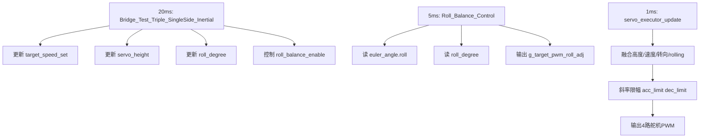

# bridge 模块文档

## 1. 模块定位
`bridge` 模块负责单边桥相关的策略控制，包含两类逻辑：

1. 正式流程：`Bridge_Trigger()` + `Bridge_Update()` 状态机。
2. 测试流程：`Bridge_Test_Smooth_PID()` 与 `Bridge_Test_Triple_SingleSide_Inertial()`。

当前重点是“仅惯导连续三单边桥测试”，即不依赖视觉实时识别，直接使用惯导里程在桥上按几何位置切换横滚目标。

---

## 2. 代码位置与依赖

- 头文件：`code/plan/bridge.h`
- 源文件：`code/plan/bridge.c`
- 中断调度入口：`user/cm7_0_isr.c`
- Rolling 控制器：`code/calculate/pid-new.c` 的 `Roll_Balance_Control()`
- 舵机执行器：`code/servo/servo_executor.c`

关键外部变量依赖：

- `inertial_nav.x / inertial_nav.y`：惯导位置（mm）
- `servo_height`：目标底盘高度
- `target_speed_set`：目标速度
- `roll_degree`：Rolling 环目标横滚角（度）
- `roll_balance_enable`：Rolling 环使能
- `acc_limit / dec_limit`：舵机斜率限制

---

## 3. 控制架构总览

该功能是“慢规划 + 快闭环 + 更快执行”的三级结构：

1. `20ms`：桥策略层（本模块）
2. `5ms`：Rolling 姿态环（PD）
3. `1ms`：舵机执行器（PWM 混控 + 斜率限幅）

调用链如下：

1. `pit0_ch0_isr()` 每 `20ms` 调用 `Bridge_Test_Triple_SingleSide_Inertial()`
2. `pit0_ch0_isr()` 每 `5ms` 调用 `Roll_Balance_Control(euler_angle.roll, roll_degree)`
3. `pit0_ch0_isr()` 每 `1ms` 调用 `servo_executor_update()`

因此策略层只产生“目标”，真正抑制倾斜由 5ms 闭环完成，执行平滑由 1ms 执行器完成。

---

## 4. 仅惯导连续三单边桥测试：实现原理

## 4.1 测试目标
在一段等效 3000mm 桥面上，模拟 3 个“左-右-左”交错单边障碍，通过惯导里程触发横滚目标切换，验证以下能力：

1. Rolling 控制方向是否正确。
2. 横滚补偿切换是否平滑。
3. 舵机限幅放开后能否快速跟随。
4. 离桥后是否可靠回零并恢复参数。

## 4.2 几何模型（与元素描述对应）
测试中采用固定参数（单位 mm）：

- 桥总长度：`BRIDGE_TEST_TOTAL_LEN_MM = 3000`
- 两端安全边距：`BRIDGE_TEST_EDGE_MARGIN_MM = 1000`
- 每个障碍长度：`BRIDGE_TEST_OBS_LENGTH_MM = 200`
- 障碍间隙：`BRIDGE_TEST_OBS_GAP_MM = 200`

由此三个障碍起点分别为：

1. `1000`
2. `1400`
3. `1800`

横滚触发窗口为：

- `trigger_begin = obstacle_start - BRIDGE_TEST_ROLL_LEAD_MM`
- `trigger_end = obstacle_start + BRIDGE_TEST_OBS_LENGTH_MM + BRIDGE_TEST_ROLL_HOLD_MM`

默认提前量 `80mm`、保持尾量 `40mm`。

## 4.3 开环目标（前馈）
“开环”体现在 `Bridge_Test_Get_Roll_Bias()`：

- 第1障碍：`+BRIDGE_TEST_ROLL_BIAS_DEG`
- 第2障碍：`-BRIDGE_TEST_ROLL_BIAS_DEG`
- 第3障碍：`+BRIDGE_TEST_ROLL_BIAS_DEG`
- 其他位置：`0`

当前默认：`BRIDGE_TEST_ROLL_BIAS_DEG = 3.0f`。

这表示几何前馈目标是 `+3° -> -3° -> +3° -> 0°`。

## 4.4 目标斜坡（抗冲击）
策略层不会将目标直接阶跃到 ±3°，而是调用 `Ramp_Float()` 进行斜坡：

- `BRIDGE_TEST_ROLL_RAMP_STEP_DEG = 0.3° / 20ms`（约 `15°/s`）

用途：

1. 抑制目标突变导致的 PD 冲击。
2. 降低舵机电流尖峰和机械抖动。

## 4.5 闭环修正（Rolling PD）
5ms 中断中执行：

```c
Roll_Balance_Control(actual_roll, target_roll)
```

其中：

- `actual_roll = euler_angle.roll`
- `target_roll = roll_degree`（由 bridge 测试状态机写入）

控制律：

```c
error = target_roll - actual_roll
u = kp * error + kd * (error - last_error)
u = constrain(u)
g_target_pwm_roll_adj = (int16)u
```

因此该方案不是纯开环，而是“几何开环目标 + 姿态闭环纠偏”。

## 4.6 执行器落地（低侧伸长 + 高侧收腿）
`servo_executor_update()` 对 `g_target_pwm_roll_adj` 的约定是：

- `>0`（左高右低）：低侧（右侧）伸长，高侧（左侧）向上收腿（收腿量最大限制 1000 duty）
- `<0`（右高左低）：低侧（左侧）伸长，高侧（右侧）向上收腿（收腿量最大限制 1000 duty）

并在最终输出前通过 `acc_limit/dec_limit` 进行斜率限制，保证动作平滑和硬件安全。

---

## 5. 测试状态机说明（`Bridge_Test_Triple_SingleSide_Inertial`）

状态定义：

1. `BRIDGE_TEST_STATE_IDLE`
2. `BRIDGE_TEST_STATE_PREPARE`
3. `BRIDGE_TEST_STATE_ON_BRIDGE`
4. `BRIDGE_TEST_STATE_EXIT`

## 5.1 IDLE
进入条件：测试开关从 0->1 后首次执行。
动作：

1. 备份当前 `acc_limit/dec_limit`
2. 重置里程起点
3. `roll_degree = 0`
4. 转入 `PREPARE`

## 5.2 PREPARE
动作：

1. 目标速度设为 `speed_ready`
2. 平滑抬高 `servo_height -> height_bridge`
3. 放开舵机斜率限制（使用桥参数）
4. `roll_balance_enable = 1`

当行驶距离超过 `BRIDGE_TEST_PREPARE_LEN_MM` 后，重置起点，转入 `ON_BRIDGE`。

## 5.3 ON_BRIDGE
动作：

1. 维持桥上高度
2. 目标速度设为 `speed_climb`
3. 根据惯导里程计算开环横滚目标
4. 通过斜坡更新 `roll_degree`

当行驶距离超过 `BRIDGE_TEST_TOTAL_LEN_MM + BRIDGE_TEST_EXIT_BUFFER_MM`，转入 `EXIT`。

## 5.4 EXIT
动作：

1. 目标速度设为 `speed_normal`
2. 平滑降高回 `height_normal`
3. `roll_degree` 斜坡回零

结束条件同时满足：

1. 高度回归（`|servo_height - height_normal| < 0.1`）
2. 横滚目标回零（`|s_test_roll_target| < 0.2`）
3. 距离超过 `cooldown_distance`

满足后：

1. 调用 `Bridge_Test_Reset_All()` 恢复斜率限制并关闭 Rolling
2. 自动将 `debug_triple_bridge_test_enable = 0`

---

## 6. 与正式桥状态机 (`Bridge_Update`) 的关系

- `Bridge_Update()` 是正式任务流程，依赖外部触发 `Bridge_Trigger(distance)`。
- `Bridge_Test_Triple_SingleSide_Inertial()` 是调试/验证流程，不依赖视觉实时触发。
- 两者不应同时启用，否则会争用 `target_speed_set`、`servo_height`、`roll_balance_enable`、`acc_limit/dec_limit`。

建议：

1. 做三单边桥测试时，仅调用 `Bridge_Test_Triple_SingleSide_Inertial()`。
2. 做正式任务时，关闭测试开关，恢复 `Bridge_Trigger + Bridge_Update`。

---

## 7. 对外接口文档

## 7.1 初始化

```c
void Bridge_Init(void);
```

作用：

1. 初始化桥参数
2. 清空桥状态
3. 关闭 Rolling
4. 复位三单边桥测试状态与开关

## 7.2 正式流程入口

```c
void Bridge_Trigger(float distance_to_bridge);
void Bridge_Update(void);
```

## 7.3 测试流程入口

```c
extern uint8_t debug_triple_bridge_test_enable;
void Bridge_Test_Triple_SingleSide_Inertial(void);
```

使用：

1. 先 `Bridge_Init()`
2. 周期调用 `Bridge_Test_Triple_SingleSide_Inertial()`（20ms）
3. 将 `debug_triple_bridge_test_enable` 置 1 开始测试

---

## 8. 关键参数表（当前默认值）

| 参数 | 默认值 | 作用 |
|---|---:|---|
| `BRIDGE_TEST_PREPARE_LEN_MM` | 300 | 进入桥段前准备距离 |
| `BRIDGE_TEST_TOTAL_LEN_MM` | 3000 | 三障碍桥段总测试长度 |
| `BRIDGE_TEST_EXIT_BUFFER_MM` | 200 | 桥尾冗余距离 |
| `BRIDGE_TEST_EDGE_MARGIN_MM` | 1000 | 两端安全边距 |
| `BRIDGE_TEST_OBS_LENGTH_MM` | 200 | 单障碍长度 |
| `BRIDGE_TEST_OBS_GAP_MM` | 200 | 障碍间距 |
| `BRIDGE_TEST_ROLL_LEAD_MM` | 80 | 障碍前提前触发量 |
| `BRIDGE_TEST_ROLL_HOLD_MM` | 40 | 障碍后保持量 |
| `BRIDGE_TEST_ROLL_BIAS_DEG` | 3.0 | 开环目标横滚角幅值 |
| `BRIDGE_TEST_ROLL_RAMP_STEP_DEG` | 0.3 | 每20ms目标横滚变化量 |

---

## 9. 时序与数据流（建议理解图）



---

## 10. 调参建议（实车）

1. 先固定 `BRIDGE_TEST_ROLL_BIAS_DEG=2.0` 验证方向是否正确，再逐步加到 `3.0~4.0`。
2. 若上障碍瞬间仍“砸桥”，先加大 `BRIDGE_TEST_ROLL_LEAD_MM`（例如 80 -> 120）。
3. 若过障碍后恢复慢，减小 `BRIDGE_TEST_ROLL_HOLD_MM`。
4. 若动作抖动，减小 `BRIDGE_TEST_ROLL_RAMP_STEP_DEG` 或减小 `ROLL_KP`。
5. 若跟随太软，适度增大 `ROLL_KP` 或放宽 `ROLL_MAX_O`。
6. 若舵机冲击大，降低桥上 `servo_acc_bridge/servo_dec_bridge`。

---

## 11. 常见问题

1. 现象：左右补偿方向反了。  
   处理：检查 IMU roll 正方向定义、`k_bridge_test_side_sign` 符号顺序、执行器 `adj` 方向约定。

2. 现象：里程触发点偏早/偏晚。  
   处理：检查惯导尺度、轮速标定，必要时整体平移触发窗口参数。

3. 现象：测试结束后仍有横滚补偿。  
   处理：确认 `debug_triple_bridge_test_enable` 已自动清零，且 5ms 环仍在调用 `Roll_Balance_Control`。

---

## 12. 安全与边界条件

1. 该测试会主动放开舵机斜率限制，必须在可控场地验证。
2. 禁止与其他会写 `roll_degree` 的任务并发。
3. 退出路径必须保留 `Bridge_Test_Reset_All()`，不要删除恢复逻辑。
4. 若中途要急停，直接将 `debug_triple_bridge_test_enable=0`，状态机会自动收敛并恢复限制。
